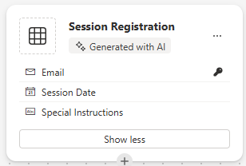

---
lab:
  title: "Labo\_2\_: Créer un modèle de données"
  learning path: 'Learning Path: Manage the Microsoft Power Platform environment'
  module: 'Module 1: Describe Microsoft Dataverse'
---

## Objectif d’apprentissage

Dans cet exercice, les apprenants utilisent Copilot pour créer un modèle de données. Vous fournirez une description du type de tables que vous souhaitez générer et utiliserez le concepteur pour apporter des modifications, telles que l’ajout de colonnes supplémentaires.

À l’issue de ce labo, vous pourrez :

- utiliser Copilot pour vous aider à créer un modèle de données.
- ajouter et modifier des colonnes dans des tables.

### Scénario

Contoso Consulting est une organisation de services professionnels spécialisée dans les services de conseil en informatique et en IA Tout au long de l’année, Contoso Consulting propose de nombreux événements différents à leurs clients. Il s’agit notamment de salons professionnels au cours desquels de nombreux partenaires viennent fournir des informations sur les nouveaux produits, les tendances du marché et les services. D’autres ont lieu tout au long de l’année et sont des webinaires rapides qui servent à fournir des détails sur des produits individuels.

Contoso aimerait utiliser Power Platform pour créer une solution de gestion des événements qui lui permettrait de gérer les différents événements organisés tout au long de l’année. En outre, Contoso cherche à créer des applications pour prendre en charge son programme de vérification de l’équipement des employés. 

Dans cet exercice, vous allez créer un modèle de données qui sera utilisé pour stocker les différents types d’événements, d’inscriptions d’événements et d’autres données nécessaires à Contoso pour gérer efficacement leurs événements. Vous allez également créer une table Équipement qui sera utilisée dans leurs autres applications.  

### Détails du labo

Avant de commencer cet exercice, il est recommandé d’effectuer les labo suivants :

- **Lab 1 – Créer une solution**

> **Important :** Ce labo utilise l’IA pour générer les composants. Étant donné que les résultats de l’IA peuvent varier, il est important de noter que vos résultats peuvent être différents (mais similaires) de ce qui est défini dans le labo. Les concepts de base décrits dans le labo seront les mêmes, peu importe ce qui a été créé ou ce qu’il a été nommé. Si les tables et colonnes ne correspondent pas exactement, vous devrez peut-être ajuster ce qui a été créé pour vous.

### Minutage des labos

La durée de cet exercice est estimée entre **30 et 45** minutes.

> **Remarque :** Dans le labo précédent, nous avons créé une solution de gestion des événements et nous l’avons définie comme solution préférée dans cet environnement. Pour cette raison, nous n’avons pas besoin d’accéder directement à la solution pour créer notre modèle de données. Les éléments que nous créons seront automatiquement ajoutés à la solution.

> **Remarque :** si vous rencontrez un message d’erreur **Besoin d’attention** sur la table lors de la création d’une colonne de choix avec Copilot, vous pouvez créer la colonne manuellement en suivant les étapes ci-dessous :
1. Sélectionnez **Options d’affichage**, puis sélectionnez **Afficher les données**. La structure de la table devient visible.
1. Cliquez sur **Nouvelle colonne** pour ajouter une nouvelle colonne.

## Tâche 1 : Créer un modèle de données

Contoso stocke actuellement les informations de contact des donateurs dans leur instance Dataverse. Il souhaite utiliser Dataverse pour suivre les subventions qu’il demande et les dons qu’il reçoit. Vous devez créer les tables nécessaires pour prendre en charge les besoins futurs de l’application de Contoso.

1.  Si nécessaire, ouvrez un navigateur web et accédez au portail de création [Power Apps](https://make.powerapps.com/), puis connectez-vous à l’aide de vos informations d’identification de compte Microsoft.
1.  Dans l’écran d’accueil de Power Apps, à l’aide de la navigation sur la gauche, sélectionnez **Tables**.
1.  Sous **Tables**, sélectionnez **Prise en main de Copilot**.
1.  Dans l’écran **Décrivez les tables que vous souhaitez que Copilot génère**, entrez : « *Crée une table pour la gestion des événements. La table doit indiquer le nom de l’événement, les données d’événement, l’emplacement, le nombre maximal de participants et les détails de l’événement. »*
1.  En regard du bouton **Générer**, sélectionnez **Paramètres de la table** et configurez-les comme suit :
    - **Options de table :** Une table
    - Ne **PAS** inclure de relations.

    

1.  Sélectionnez le bouton **Générer**.

    > **Important :** Copilot doit uniquement créer **UNE** table appelée **Événements**. Si d’autres ont été créés, vous devez les **SUPPRIMER** en indiquant à Copilot le nom de la table à supprimer. **L’échec de la suppression des tables supplémentaires aura un impact sur l’étape suivante.**

    

**Modifier le modèle de données avec Copilot**

Maintenant que nous avons créé la table, nous allons y ajouter des colonnes supplémentaires. Nous allons commencer par ajouter une colonne de type d’événement. De plus, les contacts assisteront à nos événements. Nous voulons ajouter la table Contacts existante au modèle de données et l’associer ultérieurement aux inscriptions d’événements.

7.  Dans le champ **Que souhaitez-vous faire ensuite**, entrez : *`Add a choice column named Event Type to Event table.`*
1.  Ajoutez une autre colonne en entrant le texte suivant : *`Add a choice column named Registration Required to Event table.`*

    

    > **Important :** Votre table d’événements n’a pas besoin de correspondre exactement à l’image ci-dessus, mais elle doit avoir au moins les colonnes suivantes :
    - Nom de l’événement
    - Date de l’événement
    - Nombre maximal de participants
    - Emplacement
    - Type d'événement
    - Inscription requise

    Si vous n’avez pas toutes les colonnes mentionnées ci-dessus, utilisez Copilot pour les ajouter au modèle de données.  

    Ensuite, ajoutons la table **Contact** au modèle de données.

1.  Dans la **Barre de commandes** en haut, sélectionnez **+ Table existante.**
1.  Dans le champ **Recherche**, entrez **Contact** et choisissez **Ajouter la sélection**.

    Selon le type d’événement, il peut y avoir une ou plusieurs sessions. Pour gérer les différentes sessions, nous devons définir ce que la session est et l’événement auquel elle est associée. Ensuite, nous allons utiliser Copilot pour créer une table Sessions d’événements.

1.  Dans le champ **Que souhaitez-vous faire ensuite**, entrez : *`Add a new table called Event Session. `*

    Copilot créera probablement deux tables, Session d’événements et Intervenant de l’événement. Étant donné que nos contacts seront des intervenants, nous allons supprimer la table Intervenants de l’événement.

1.  Si nécessaire, dans le champ **Que souhaitez-vous faire ensuite ?**, entrez : *`Remove the Event Speaker table.`*
1.  Dans Copilot, entrez le texte suivant : *`Add a new text column to the Event Session table called Session Description.`*

    

    Ensuite, nous allons ajouter une dernière table appelée **Inscriptions à la session**. Cette table sera utilisée pour gérer les personnes qui s’inscrivent à des sessions spécifiques.

1.  Dans Copilot, entrez le texte suivant : *`Add a new table called Session Registrations.`*

    Copilot créera probablement deux tables, Inscription de session, Session ou Participant (ou autre chose). Étant donné que nos contacts peuvent être des participants, nous allons supprimer la table Participants. Si d’autres tables (telles que Session ou autre) autres que Inscription de session ont été créées, supprimez-les.

1.  Si nécessaire, dans Copilot, entrez le texte suivant : *`Remove the Participant table.`*
    
    Parfois, une colonne Nom du participant est ajoutée à la table d’inscription de session. Nous devons la supprimer, car cela peut entraîner des problèmes ultérieurement lorsque nous essayons d’enregistrer le modèle de données. (Nous allons la remplacer par une autre colonne de participants ultérieurement.)  

1.  Si nécessaire, dans Copilot, entrez le texte suivant : *`Remove the Participant Name column from the Session Registration table.`*

1.  Si vous disposez maintenant d’un champ Colonne principale, entrez le texte suivant : *`Rename the Primary Column to Registration Name in Session Registration table.`*

1.  Dans Copilot, entrez le texte suivant : *`Add a text column to the Session registration table called Special Instructions.`*

    Votre table Inscription de session terminée doit ressembler à l’image ci-dessous :

    

    > **Important** Bien que la vôtre ne doive pas correspondre exactement, il est important que vous n’ayez pas de colonne nommée Participant et que vous ayez au moins les éléments suivants :
    - Nom de l’inscription
    - Date de la session
    - Instructions spéciales

    Nous allons maintenant créer des relations entre nos différentes tables. Comme les enregistrements de contacts peuvent être des intervenants dans les sessions, nous allons créer une relation entre les tables Contact et Session d’événement.

1.  Dans la barre de commandes, sélectionnez **Créer des relations**.
1.  Configurez la relation comme suit :
    - **Type de relation :** Une-à-plusieurs
    - **Un :** Contact
    - **Plusieurs :** Session d’événements
    - **Nom d’affichage** : `Speaker`
1.  Cliquez sur **Terminé**.

    

    Étant donné que les contacts peuvent être inscrits pour les sessions dans des sessions, nous allons créer une relation entre les tables Contact et Inscription de session.

1.  Dans la **Barre de commandes**, sélectionnez **Créer des relations**.
1.  Configurez la relation comme suit :
    - **Type de relation :** Une-à-plusieurs
    - **Un :** Contact
    - **Plusieurs :** Inscription de session
    - **Nom d’affichage** : `Participant`

    

1.  Cliquez sur **Terminé**.

    Un événement unique peut avoir plusieurs sessions associées. Nous allons donc créer une relation entre les tables Événements et Session d’événement.

1.  Dans la **Barre de commandes**, sélectionnez **Créer des relations**.
1.  Configurez la relation comme suit :
    - **Type de relation :** Une-à-plusieurs
    - **Un :** Événement
    - **Plusieurs :** Session d’événements
    - **Nom d’affichage** : `Event`

    

1. Cliquez sur **Terminé**.

    Enfin, les participants s’inscrivent aux sessions de l’événement, et nous devons donc créer une relation entre les tables Sessions de l’événement et Inscriptions à la session.

1.  Dans la **Barre de commandes**, sélectionnez **Créer des relations**.
1.  Configurez la relation comme suit :
    - **Type de relation :** Une-à-plusieurs
    - **Un :** Session d’événements
    - **Plusieurs :** Inscriptions à la session
    - **Nom d’affichage** : `Event Session`

    

1.  Cliquez sur **Terminé**.

    Votre modèle de données nouvellement créé doit ressembler à l’image :

    

1.  Sélectionnez **Enregistrer et quitter**.

## Tâche 2 : Modifier des tables et des colonnes directement

Copilot est un excellent moyen de créer des tables et des colonnes très rapidement. Cependant, il peut arriver que vous ayez besoin de modifier directement les tables et les colonnes. Par exemple, dans cette tâche, nous allons mettre à jour certaines colonnes existantes, ainsi que suivre le nombre de participants inscrits pour une session spécifique.

1.  Si nécessaire, ouvrez un navigateur web et accédez au portail de création [Power Apps](https://make.powerapps.com/), puis connectez-vous à l’aide de vos informations d’identification de compte Microsoft.
1.  Dans le volet de navigation de gauche, sélectionnez **Tables**.
1.  Dans le champ **Recherche**, entrez **Évènement**.
1.  Ouvrez la table **Événement**.
1.  Sous le titre **Schéma**, sélectionnez **Colonnes**.
1.  Recherchez et ouvrez la colonne **Type d’événement**.
1.  Remplacez les étiquettes par les éléments suivants :
    - Conférence
    - Salon
    - Webinaire
    - Déjeuner et apprendre
    - Lancer
1.  Définissez le **Choix par défaut** sur **Aucun**.

    

1.  Sélectionnez le bouton **Enregistrer**. (*Si la colonne ne parvient pas à s’enregistrer, réessayez.*)

    Ensuite, nous allons ajouter une nouvelle colonne à la table **Session d’événements** pour suivre le nombre total d’inscriptions de session.

1.  À l’aide de la navigation à gauche, sélectionnez **Tables** pour quitter la table **Événements**.
1.  Dans le champ **Recherche**, entrez **Évènement**.
1.  Ouvrez la table **Session d’événements**.
1.  Sous le titre **Schéma**, sélectionnez **Colonnes**.
1.  Dans la barre de commandes, cliquez sur le bouton **Nouvelle colonne**.
1.  Configurez la nouvelle colonne comme suit :
    - **Nom d’affichage** : `Total Registrations`
    - **Type de données :** Nombre entier
    - **Comportement** : Cumul

    

1.  Cliquez sur **Enregistrer et modifier**.

    > **Important :** Si votre bloqueur de fenêtres publicitaires est activé, vous devrez peut-être le désactiver pour que le champ de cumul s’affiche.

1.  Configurez la colonne Cumul comme suit :
    - Sous **Entité associée**, sélectionnez **Ajouter une entité associée**.
    - Choisissez la table **Inscription à la session**.
    - Sélectionnez le bouton **Enregistrer vos modifications** (*coche*).
    - Sous **Agrégation**, sélectionnez **Ajouter une agrégation**.
    - Sous **Fonction d’agrégation**, choisissez **Nombre**.
    - Pour **Champ d’entité associée agrégée**, sélectionnez **Inscription à la session**.
    - Sélectionnez le bouton **Enregistrer vos modifications** *(coche)*

    

1.  Sélectionnez le bouton **Enregistrer et fermer**.

    Vous avez maintenant créé le modèle de données qui sera utilisé pour prendre en charge l’application de gestion des événements. 

## Tâche 3 : Créer une table d’équipement

En plus de gérer les événements, Contoso dispose d’un programme de vérification de l’équipement.  Ensuite, nous allons créer la table pour stocker l’équipement. 
1.  Dans le volet de navigation de gauche, sélectionnez **Tables**.
1.  Sous **Tables**, sélectionnez **Prise en main de Copilot.**
1.  Dans l’écran **Décrivez les tables que vous souhaitez que Copilot génère**, entrez : *`Create a table for checking out equipment. The table should include the Equipment Name, Due Date, and Item number.`*
1.  En regard du bouton **Générer**, sélectionnez **Paramètres de la table** et configurez-les comme suit :
    - **Options de table :** Une table
    - Ne **PAS** inclure de relations.

    

1. Sélectionnez le bouton **Générer**.

    > **Important :** Copilot ne doit créer qu’une seule table appelée **Vérification de l’équipement**. Si d’autres tables ont été créés, vous pouvez les supprimer, en indiquant à Copilot le nom de la table à supprimer.

**Modifier le modèle de données avec Copilot**

Maintenant que nous avons créé la table, nous allons y ajouter des colonnes supplémentaires. Nous allons commencer par ajouter une colonne de type d’événement. De plus, les contacts assisteront à nos événements. Nous voulons ajouter la table Contacts existante au modèle de données et l’associer ultérieurement aux inscriptions d’événements.

6.  Dans le champ **Que souhaitez-vous faire ensuite**, entrez : *`Rename the table to Equipment.`*
1.  Dans le champ **Que souhaitez-vous faire ensuite**, entrez : *`Add a choice column named Equipment type.`*
1.  Ajoutez une autre colonne en entrant le texte suivant : *`Add a text column named Category.`*
1.  Ajoutez une autre colonne en entrant le texte suivant : *`Add a text column named Status.`*

    Une fois terminé, la table doit ressembler à l’image ci-dessous :

    

1.  Si votre table inclut des colonnes supplémentaires, supprimez ces colonnes en entrant *`Delete the [column name] column.`*
1.  Une fois que votre table correspond à l’image, sélectionnez **Enregistrer et quitter**.

## Tâche 4 : Modifier directement la table Équipement

1.  Si nécessaire, ouvrez un navigateur web et accédez au portail de création Power Apps, puis connectez-vous à l’aide de vos informations d’identification de compte Microsoft.
1.  Dans le volet de navigation de gauche, sélectionnez **Tables**.
1.  Dans le champ **Recherche**, entrez **Équipement.**
1.  Ouvrez la table **Équipement**.
1.  Sous le titre **Schéma**, sélectionnez **Colonnes**.
1.  Recherchez et ouvrez la colonne **Type d’équipement**.
1.  Si nécessaire, remplacez les étiquettes par les éléments suivants :
    - Électronique
    - Meubles
    - Outils
    - Accessories
1.  Définissez le **Choix par défaut** sur **Aucun**.

    

1.  Sélectionnez le bouton Enregistrer. (Si la colonne ne parvient pas à s’enregistrer, réessayez.)

Félicitations, vous avez créé un modèle de données dans Microsoft Dataverse.

