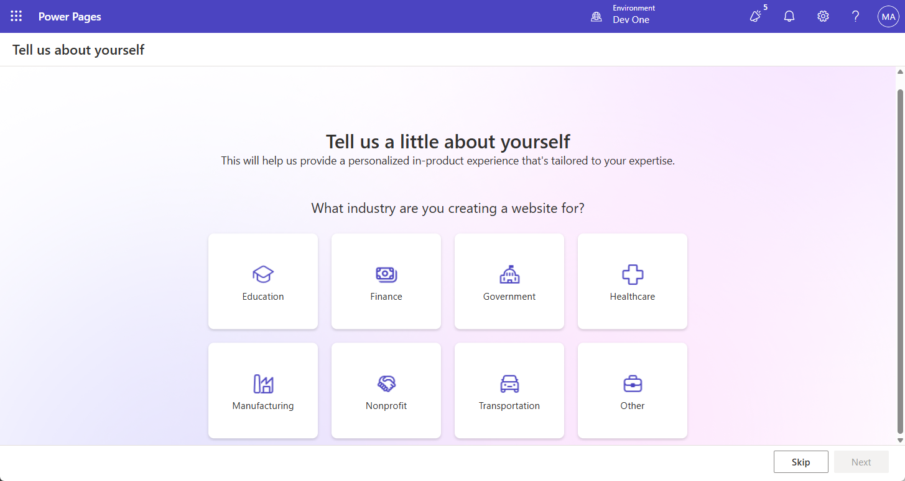

---
lab:
  title: "Labo 3\_: Créez un site Power Pages"
  learning path: 'Learning Path: Demonstrate the capabilities of Microsoft Power Pages'
  module: 'Module 2: Create a Microsoft Power Pages site'
---
## Objectif d’apprentissage

Dans cet exercice, les apprenants utiliseront Copilot pour créer un site Power Pages. Une fois le site créé, vous allez utiliser Power Pages Design Studio pour effectuer des tâches comme l’ajout et la modification de contenu, ainsi que la modification des thèmes.

### Scénario

Tout au long de l’année, Contoso Consulting héberge de nombreux événements de différents types. Il s’agit notamment d’événements en présentiel, de webinaires, de formations dispensées par des instructeurs, etc. L’entreprise Contoso Consulting souhaite utiliser Microsoft Power Platform pour gérer les différents événements qu’elle organise. Elle souhaite utiliser Power Pages pour créer un site de gestion d’événement qui affiche les différents événements qu’elle héberge.

À l’issue de cet exercice, vous pourrez :

-   Utilisez Copilot pour créer un site web Gestion d’événement.
-   Ajoutez un nouveau contenu à votre site.
-   Affichez un aperçu de votre nouveau site Power Pages de différents types d’appareils.

**Détails du labo :**

Avant de commencer cet exercice, vous devez avoir effectué le labo suivant :

- **Lab 2 – Créer un modèle de données**

> **Important :** Ce labo utilise l’IA pour générer les composants. Étant donné que les résultats de l’IA peuvent varier, il est important de noter que vos résultats peuvent être différents (mais similaires) de ce qui est défini dans le labo. Les concepts de base décrits dans le labo seront les mêmes, peu importe ce qui a été créé ou ce qu’il a été nommé. Si les tables et colonnes ne correspondent pas exactement, vous devrez peut-être ajuster ce qui a été créé pour vous.

La durée de cet exercice est estimée entre **30 et 45** minutes.

**Avant de commencer :** Si c’est la première fois que vous accédez au portail Power Pages maker, vous devrez peut-être exécuter une configuration.  Si c’est le cas, procédez comme suit.  Sinon, vous pouvez passer à la **tâche 1.**  

1.  Si nécessaire, accédez à [Microsoft Power Pages](https://make.powerpages.microsoft.com).
2.  Dans l’écran **Bienvenue dans Power Pages**, sélectionnez le bouton **Démarrage**.

3. Sur l’écran **Parlez-nous un peu de vous**, sélectionnez le bouton **Ignorer**.

## Tâche 1 : Utilisez Copilot pour créer un site Power Pages.

1.  Si nécessaire, accédez à <https://make.powerpages.microsoft.com>
2.  Dans la page d’accueil de **Studio de conception Power Pages**, entrez le texte suivant : « *Créez un site pour gérer les événements que notre organisation héberge ».*
3.  Sélectionnez le bouton **Envoyer**.
4.  Dans l’écran **Vérifier les détails du site de base**, configurez comme suit :
    - **Donnez un nom à votre site :** Gestion des événements Contoso
    - **Créez une adresse web :** Accepter l’adresse par défaut fournie
    - **Langage du site :** Anglais

5.  Sélectionnez le bouton **Suivant**.
6.  Dans l’écran **Choisir une disposition**, passez en revue la disposition suggérée fournie. Si vous souhaitez des suggestions de disposition supplémentaires, sélectionnez **Réessayer** pour que **Copilot** suggère une autre disposition.
7.  Une fois que vous avez identifié le modèle que vous souhaitez utiliser, sélectionnez **Suivant.**
8.  Dans la section **Ajouter des page communes**, sélectionnez les pages suivantes :
    - Qui sommes-nous
    - Contactez-nous
    - FAQ
    - Sélectionnez les pages supplémentaires souhaitées.
9.  Une fois que vous avez sélectionné vos pages, sélectionnez **Terminé**.

Votre nouveau site sera créé en arrière-plan, ce qui peut prendre plusieurs minutes.

10.  Une fois votre site créé, ouvrez-le (si ce n’est pas déjà fait.)

> **Remarque :** Parfois, lorsque votre site se charge pour la première fois, vous pouvez voir s’afficher un message indiquant qu’un objet Liquid est introuvable. Dans ce cas, actualisez (F5) la fenêtre du navigateur pour recharger le site. Le site doit apparaître.

## Tâche 2 : Modifier le contenu de votre site

Maintenant que vous avez créé le site initial, vous pouvez utiliser le studio de conception pour modifier votre site en ajoutant des pages, du texte, des images, des formulaires, etc.

1.  Dans **Navigation principale**, sélectionnez **Accueil** pour ouvrir la page d’**Accueil**.
2.  Placez le curseur sur le texte **Site de gestion d’événement Contoso** dans l’en-tête du site, puis sélectionnez **Modifier l’en-tête de site**.
3.  Remplacez le **Titre du site** par **Contoso Consulting**.
4.  Sélectionnez le bouton **Charger l’image**.
5.  Dans l’écran **Ajouter une image**, sélectionnez **Charger** une image, choisissez le **Logo Contoso** à partir de vos fichiers de classe, puis **Ouvrez**.
6.  Une fois l’image de **Logo Contoso** sélectionnée, sélectionnez **OK**.
7.  Une fois les modifications terminées, sélectionnez le **X** pour quitter l’écran **Modifier l’en-tête du site**.
8.  Pour modifier l’image d’arrière-plan du site, cliquez n’importe où dans l’image d’arrière-plan.
9.  Dans le menu qui s’affiche, choisissez **Modifier l’arrière-plan**.
10. Sélectionnez le bouton **Modifier l’image**.
11. Sélectionnez **Bibliothèque média** et choisissez **Charger une image**.
12. Sélectionnez l’image **Site_Background** dans vos fichiers de classe, puis choisissez **Ouvrir**.
13. Une fois la Site_Background sélectionnée, choisissez **OK**.
14. Sélectionnez le texte **Bienvenue dans Événements Contoso** et remplacez-le par **Contoso Consulting**.
15. Dans la barre d’outils qui s’affiche, sélectionnez le bouton **Conception** *(Pinceau)*.
16. Sélectionnez la flèche à côté de la propriété **Ombre de texte** et définissez le**Décalage-H** sur **2**.
17. Sélectionnez le **X** pour fermer la fenêtre **Conception de texte**.
18. Sélectionnez le texte ci-dessous Contoso Consulting *(Pourrait s’agir de quelque chose comme Votre partenaire en Gestion d’événement)* et remplacez-le par **Votre partenaire d’aujourd’hui et de demain.**

Maintenant que nous avons apporté des modifications essentielles à la page d’accueil, nous allons mettre à jour le thème du site pour mieux correspondre à la marque de Contoso.

19.  Dans le volet de navigation de gauche, sélectionnez le bouton **Style**.
20.  Sélectionnez le thème **Bleu clair**.
21.  Sous **les couleurs de la marque**, sélectionnez le cercle de couleurs **Gris**.
22.  Modifiez la couleur **Hexadécimale**** : 101E2B**
23.  Cliquez sur **OK**.
24.  Sélectionnez le cercle **Blanc** et remplacez la couleur par code **Hexadécimal** **e8e8e8**
25.  Sélectionnez **OK**.
26.  Sélectionnez le cercle **Noir** et remplacez la couleur par **Blanc**. (ffffff)
27.  Cliquez sur **OK**.
28. Apportez d’autres modifications de thème souhaitées. Une fois que vous avez terminé de modifier votre thème, sélectionnez le bouton **Enregistrer**.

## Tâche 3 : Connecter votre site à vos données commerciales

L’un des principaux avantages de Power Pages est la possibilité de connecter une page Power Pages à vos données commerciales qui se trouve dans Dataverse. Avant de pouvoir intégrer les données, nous devons générer certains éléments qui seront utilisés.

1.  Dans le volet de navigation de gauche, sélectionnez l’icône **Données**.
2.  Dans le champ **Recherche**, entrez **Évènement**.
3.  Sélectionnez le tableau **Événement**.

Tout d’abord, nous allons créer un formulaire qui sera utilisé lorsque nous voulons ajouter un nouvel événement.

4.  Sélectionnez l’onglet **Formulaires**, puis choisissez **Nouveau formulaire**.
5.  Définissez le **Nom du formulaire** sur **Créer un événement**, puis sélectionnez le bouton **Créer**.
6.  Nous n’allons apporter aucune modification à la disposition. Cliquez sur le bouton **Enregistrer et publier**.
7.  Sélectionnez la **Flèche précédente** pour revenir dans l’éditeur.

Ensuite, nous allons créer un formulaire qui sera utilisé pour l’affichage et la modification d’événements existants

8.  Sélectionnez le bouton **Nouveau formulaire**.
9.  Nommez le formulaire **Afficher l’événement**, puis sélectionnez le bouton **Créer**.
10.  Dans la **Barre de commandes**, sélectionnez **Ajouter un composant**, puis **Sous-réseau**.
11.  Configurez le sous-réseau comme suit :
    -   **Afficher les enregistrements associés** Oui
    -   **Table :** Sessions d’événements
    -   **Par défaut :** Sessions actives
12.  Cliquez sur **Terminé**.
13.  Cliquez sur le bouton **Enregistrer et publier**.
14.  Sélectionnez le bouton **Précédent** pour revenir à **Design Studio**.

## Tâche 4 : Créer des formulaires de page web nécessaires

Maintenant que nous avons défini des formulaires pour la table d’événements, nous allons créer des pages qui incluent ces formulaires afin que les utilisateurs du site puissent travailler avec les enregistrements d’événements. Nous allons créer des pages pour l’affichage, la création et la modification d’événements.

1.  Dans le volet de navigation de gauche, sélectionnez l’icône **Pages**.
2.  Sélectionnez le bouton **+ Page**.
3.  Dans **Copilot**, entrez le texte suivant : *« Ajouter une nouvelle page vierge. »* Sélectionnez le bouton **Envoyer**.
4.  Sélectionnez le bouton **Conserver**.
5.  En haut de la nouvelle page, sélectionnez le bouton **Ajouter une section**.
6.  Sélectionnez **1 colonne**.
7.  Dans **Choisir un composant à ajouter à cette section**, sélectionnez **Formulaire**.
8.  Sélectionnez **+ Nouveau formulaire**.
9.  Dans l’écran **Ajouter un formulaire**, configurez comme suit :
    - **Choisir une table :** Événement
    - **Sélectionnez un formulaire :** Créer un événement
    - **Nommez votre copie du formulaire sélectionné :** Créer un événement
10. Sélectionnez l’onglet **Données** et vérifiez que les **Données de ce formulaire** sont définies sur **Créer un enregistrement**.
11. Sélectionnez l’onglet **Sur l’envoi**. Dans le champ **Afficher ce message**, entrez *« Votre événement a été envoyé avec succès. »*
12. Cliquez sur le bouton **OK**.

Nous allons supprimer toutes les sections supplémentaires de la page, car nous n’en avons pas besoin.

13. Sélectionnez la **Section** sous le **Formulaire** que vous venez d’ajouter. Dans la barre d’outils qui s’affiche, sélectionnez Plus **(...)** et choisissez **Supprimer**.
14. Répétez l’étape précédente pour supprimer les deux sections restantes de la page.

Une fois terminé, les seuls éléments qui doivent rester sont le formulaire que vous avez créé et le pied de page en bas de la page.

15. Sous **Navigation principale** à gauche, sélectionnez les points de suspension à côté de la **Nouvelle page** que vous avez créée.
16. Dans le menu qui s’affiche, sélectionnez **Paramètres de la page**.
17. Configurez les paramètres de la page comme suit :
    - **Nom :** Nouvel événement
    - **URL partielle :** Nouveaux événements
18. Cliquez sur le bouton **OK**.

Ensuite, nous allons ajouter une page supplémentaire qui peut être utilisée pour afficher un événement individuel.

19.  Vérifiez que vous avez toujours sélectionné **Pages**, puis cliquez sur le bouton **+ Page**.
20.  Dans la page **Décrire une page pour la créer**, entrez : « *Ajouter une page vierge nommée Afficher l’événement.*  » Sélectionnez le bouton **Envoyer**.
21.  Sélectionnez le bouton **Conserver** pour accepter la nouvelle page.
22.  En haut de la nouvelle page, sélectionnez le bouton **Ajouter une section**.
23.  Sélectionnez **1 colonne**.
24.  Dans **Choisir un composant à ajouter à cette section**, sélectionnez **Formulaire**.
25.  Sélectionnez **+ Nouveau formulaire**.
26.  Dans l’écran **Ajouter un formulaire**, configurez comme suit :
    - **Choisir une table :** Événement
    - **Sélectionnez un formulaire :** Afficher l’événement
    - **Nommez votre copie du formulaire sélectionné :** Afficher l’événement
27.  Sélectionnez l’onglet **Données** et définissez le champ **Données de ce formulaire**sur **En lecture seule**.
28. Cliquez sur le bouton **OK**.

Nous allons supprimer toutes les sections supplémentaires de la page, car nous n’en avons pas besoin.

29. Sélectionnez la **Section** sous le **Formulaire** que vous venez d’ajouter. Dans la barre d’outils qui s’affiche, sélectionnez Plus **(...)** et choisissez **Supprimer**.
30. Répétez l’étape précédente pour supprimer la section restante de la page.
31. Sous **Navigation principale** à gauche, sélectionnez les **points de suspension** à côté de la nouvelle page que vous avez créée.
32. Dans le menu qui s’affiche, sélectionnez **Paramètres de la page**.
33. Configurez les paramètres de la page comme suit :
    - **Nom :** Afficher l’événement
    - **URL partielle :** View-Events
34. Cliquez sur le bouton **OK**.

Enfin, nous allons créer un formulaire de page web supplémentaire que nous pouvons utiliser pour modifier un événement.

35.  Vérifiez que vous avez toujours sélectionné **Pages**, puis cliquez sur le bouton **+ Page**.
36.  Dans la page **Décrire une page pour la créer**, entrez : « *Ajouter une page vierge nommée Modifier l’événement.*  » Sélectionnez le bouton **Envoyer**.
37.  Sélectionnez le bouton **Conserver** pour accepter la nouvelle page.
38.  En haut de la nouvelle page, sélectionnez le bouton **Ajouter une section**.
39.  Sélectionnez **1 colonne**.
40.  Dans **Choisir un composant à ajouter à cette section**, sélectionnez **Formulaire**.
41.  Sélectionnez **+ Nouveau formulaire**.
42.  Dans l’écran **Ajouter un formulaire**, configurez comme suit :
    - **Choisir une table :** Événement
    - **Sélectionnez un formulaire :** Créer un événement
    - **Nommez votre copie du formulaire sélectionné :** Modifier un événement
43.  Sélectionnez l’onglet **Données** et définissez **Données de ce formulaire** sur **Mises à jour d’un enregistrement**existant.
44. Cliquez sur le bouton **OK**.

Nous allons supprimer toutes les sections supplémentaires de la page, car nous n’en avons pas besoin.

45. Sélectionnez la **Section** sous le **Formulaire** que vous venez d’ajouter. Dans la barre d’outils qui s’affiche, sélectionnez Plus **(...)** et choisissez **Supprimer**.
46. Répétez l’étape précédente pour supprimer les sections restantes de la page.
47. Cliquez sur le bouton **OK**.

## Tâche 5 : Créer une page qui affiche une liste d’événements

Maintenant que nous avons défini les formulaires nécessaires à la gestion des enregistrements, nous allons créer une vue de page pour afficher ces enregistrements.

1.  Sélectionnez le bouton **+ Nouvelle page** .
2.  Dans la page **Décrire une page pour la créer**, entrez : *« Ajouter une page vierge appelée événements. »* Sélectionnez le bouton **Envoyer**.
3.  Sélectionnez **Conserver** pour accepter la nouvelle page.
4.  En haut de la nouvelle page, sélectionnez le bouton **Ajouter une section**.
5.  Sélectionnez **1 colonne**.
6.  Dans **Choisir un composant à ajouter à cette section**, sélectionnez **Formulaire**.
7.  Sélectionnez le bouton **Plus** *(…)*. Sous le groupe **Données connectées**, sélectionnez **Liste**.
8.  Dans l’écran **Ajouter une liste**, sélectionnez l’onglet **Configuration** et configurez comme suit :
    - **Choisir une table :** Événement
    - **Sélectionnez les vues de données :** Événements actifs, événements inactifs
    - **Nom de votre liste :** Événements
9.  Sélectionnez l’onglet **Actions** et configurez comme suit :
    - **Créer un enregistrement :** Activé(e)
        - **Type de cible :** Formulaire
        - **Formulaire :** Créer un événement
        - **Étiquette d’affichage :** Créer un événement
    - **Afficher les détails :** Activé(e)
        - **Type de cible :** Formulaire
        - **Formulaire :** Afficher l’événement
        - **Étiquette d’affichage :** Afficher les détails de l’événement
    - **Modifier l’enregistrement :** Activé(e)
        - **Type de cible :** Formulaire
        - **Formulaire :** Modifier un événement
        - **Étiquette d’affichage :** Modifier un événement
9. Cliquez sur **Terminé**.

## Tâche 6 : Mettre à jour les autorisations

Pour s’assurer que les utilisateurs ne voient que les données qui les concernent, les organisations peuvent définir des autorisations d’accès aux tables. Dans cette tâche, nous allons créer des autorisations très basiques qui permettent à tout le monde d’accéder au système.

1.  Sous **Navigation principale**, sélectionnez la page **Événements**.
2.  Sélectionnez la liste des **Événements**, puis cliquez sur le bouton **+ Nouvelle autorisation**.
3.  Configurez l’autorisation comme suit :
    -   **Nom :** Événements
    -   **Table :** Événement
    -   **Type d’accès :** Accès mondial
4.  Définissez **Permission** sur **Lecture**.
5.  Sélectionnez **Ajouter des rôles**, puis choisissez les rôles **Administrateurs**, **Utilisateurs anonymes** et **Utilisateurs authentifiés**.
6.  Sélectionnez le bouton **Enregistrer**.
7.  Un écran indiquant que **Les données peuvent être consultées par tout le monde** s’affiche, sélectionnez **Enregistrer**.

Répétons ce processus pour les pages de formulaire d’événement. Nous allons commencer par la page **Nouvel événement**

8.  Sous **Navigation principale**, sélectionnez la page **Nouvel événement**.
9.  Sélectionnez le bouton **Mettre à jour l’autorisation**.
10.  Configurez l’autorisation comme suit :
    -   **Nom :** Créer des événements
    -   **Table :** Événement
    -   **Type d’accès :** Accès mondial
11.  Définissez l’option **Autorisation ** sur **Lecture** et **Création**.
12.  Sélectionnez **Ajouter des rôles**, puis choisissez les rôles **Administrateurs**, **Utilisateurs anonymes** et **Utilisateurs authentifiés**.
13.  Sélectionnez le bouton **Enregistrer**, puis sélectionnez à nouveau **Enregistrer** dans l’écran contextuel.

Ensuite, nous allons définir pour l’écran **Modifier l’événement**.

14.  Sous **Navigation principale**, sélectionnez la page **Modifier l’événement**.
15.  Sélectionnez le bouton **Mettre à jour l’autorisation**.
16.  Configurez l’autorisation comme suit :
    -   **Nom :** Créer des événements
    -   **Table :** Événement
    -   **Type d’accès :** Accès mondial
17.  Définissez l’option **Autorisation ** sur **Lecture** et **Mise à jour**.
18.  Sélectionnez **Ajouter des rôles**, puis choisissez les rôles **Administrateurs**, **Utilisateurs anonymes** et **Utilisateurs authentifiés**.
19.  Sélectionnez le bouton **Enregistrer**, puis sélectionnez à nouveau **Enregistrer** dans l’écran contextuel.

## Tâche 7 : Mettre à jour la navigation sur le site

Maintenant que nos pages et nos éléments sont mis en forme comme nous le voulons, nous allons donc ajuster la navigation du site.

1.  Sous **Navigation principale**, sélectionnez les **Points de suspension** à côté de la page **Événement**.
2.  Dans le menu qui s’affiche, sélectionnez **Déplacer vers le haut**.
3.  Répétez l’étape jusqu’à la page **Événement** située sous la page **Nous contacter**.
4.  Vérifiez que la page **Nouvel événement** se trouve directement sous la page **Événements**. *(Si ce n’est pas le cas, déplacez la page Nouvel événement jusqu’à ce qu’elle soit.)*
5.  Dans la page **Nouvel événement**, sélectionnez le bouton **Points de suspension**.
6.  Dans le menu qui s’affiche, sélectionnez **En faire une sous-page**.
7.  Sélectionnez les points de suspension à côté de **Afficher l’événement**, puis sélectionnez **Déplacer vers d’autres pages**.
8.  Sélectionnez les points de suspension à côté de **Modifier l’événement**, puis sélectionnez **Déplacer vers d’autres pages**.
9.  Dans la **Barre de commandes**, sélectionnez sur le bouton **Synchroniser**.

## Tâche 8 : Afficher un aperçu et affiner votre site

Une fois votre site créé, vous devrez l’examiner attentivement afin de vous assurer qu’il répond aux besoins et aux exigences de votre entreprise, et déterminer les améliorations qui pourraient être nécessaires. Les sites peuvent être prévisualisés en mode Bureau et Mobile.

1.  Dans le studio de conception, sélectionnez le bouton page d’**Accueil**.
2.  Cliquez sur **Aperçu** dans la barre de commandes.
3.  Sélectionnez **Bureau** pour afficher un aperçu de votre site dans un navigateur.
4.  Lors de l’affichage en mode **Bureau**, examinez les aspects suivants de votre site :
    -   la disposition et la navigation.
    -   Éléments de personnalisation tels que les couleurs, les polices et les logos.
5.  Une fois que vous avez terminé de tester le site, fermez l’**onglet Navigateur** pour revenir à l’éditeur de site.

Ensuite, nous allons afficher un aperçu du site tel qu’il apparaît sur les appareils mobiles.

6.  Sélectionnez à nouveau le bouton **Aperçu**.
7.  Scannez le **code QR** affiché avec votre appareil mobile.
8.  Le site s’ouvre sur votre appareil mobile *(Remarque : vous serez peut-être invité à vous connecter. Si tel est le cas, fournissez vos informations d’identification de connexion.)*
9.  Comme vous l’avez fait en mode Bureau, examinez les aspects suivants de votre site, tels que :
    - la disposition et la navigation.
    - Éléments de personnalisation tels que les couleurs, les polices et les logos.
10. Une fois que vous avez terminé le test, fermez l’onglet du navigateur pour revenir au site.
