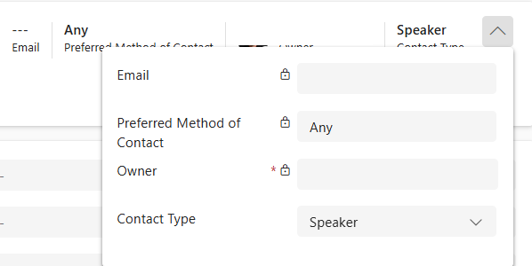
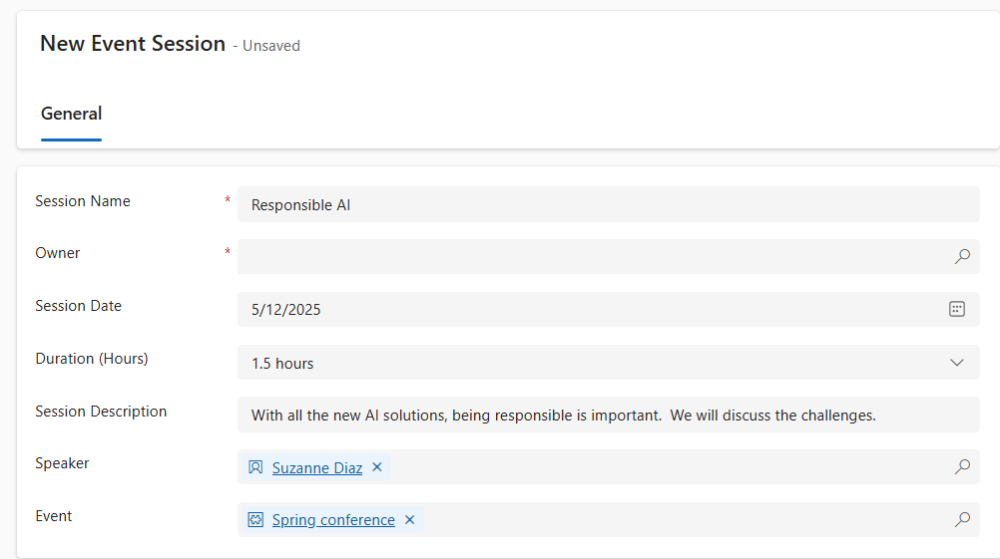

---
lab:
  title: "Labo\_5\_: Créer une application pilotée par modèle"
  learning path: 'Learning Path: Demonstrate the capabilities of Microsoft Power Apps'
  module: 'Module 3: Build a model-driven app'
---
## Objectif d’apprentissage

Dans cet exercice, les apprenants créent une application pilotée par modèle dans Power Apps à l’aide de Copilot. Vous allez définir le modèle de données, modifier les formulaires et les vues, et créer l’application.

**À l’issue de ce cours pratique, vous serez en mesure de :**

-   Générer une application basée sur des modèles.
-   Modifier les formulaires et les vues dans l’application pour répondre le mieux à vos besoins.
-   Naviguer dans une application pilotée par un modèle.

### Scénario

Contoso Consulting est une organisation de services professionnels spécialisée dans les services de conseil en informatique et en IA Tout au long de l’année, Contoso Consulting propose de nombreux événements différents à leurs clients. Il s’agit notamment de salons professionnels au cours desquels de nombreux partenaires viennent fournir des informations sur les nouveaux produits, les tendances du marché et les services. D’autres ont lieu tout au long de l’année et sont des webinaires rapides qui servent à fournir des détails sur des produits individuels.

Contoso aimerait utiliser Power Platform pour créer une solution de gestion des événements qui lui permettrait de gérer les différents événements organisés tout au long de l’année.

Cet exercice consiste à créer une application pilotée par un modèle pour gérer les événements de Contoso. L’application pilotée par modèle est basée sur un modèle de données existant et inclut les événements, les sessions d’événements et les inscriptions à la session.

### Détails du labo :

Avant de commencer cet exercice, il est recommandé d’effectuer les étapes suivantes :

-   **Lab 1 – Créer une solution**
-   **Lab 2 – Créer un modèle de données**

La durée de cet exercice est estimée entre **20 et 30** minutes.

## Tâche 1 : Créer un modèle de données pour prendre en charge votre nouvelle application pilotée par modèle

Contoso stocke actuellement les informations de contact dans leur instance Dataverse. Ils souhaitent donc utiliser Dataverse pour suivre les cours et les inscriptions aux cours. Vous devez créer les tableaux nécessaires pour prendre en charge l’application et créer une application pilotée par un modèle basé sur ce modèle de données.

1.  Si nécessaire, ouvrez un navigateur web et accédez au portail de création [Power Apps](https://make.powerapps.com/), puis connectez-vous à l’aide de vos informations d’identification de compte Microsoft.
1.  Dans le volet de navigation de gauche, sélectionnez **Solutions.**
1.  Ouvrez la solution **Gestion des événements** que vous avez créée précédemment.
1.  Dans la **Barre de commandes**, sélectionnez **Nouveau** \> **Application** \>**Application pilotée par modèle**.
1.  Sélectionnez la section **Créer**.
    -   **Nom :** `Contoso Event Management`
    -   **Description :**` Used to manage Events and Event Sessions`.
1.  Cliquez sur le bouton **Créer**.
1.  Sélectionnez le bouton **+Ajouter une page**, sélectionnez **Table Dataverse.**
1.  Sélectionnez les tables suivantes :
    -   Contact
    -   Événement
    -   Session d’événements
    -   Inscription à la session
1.  Assurez-vous que l’option **Afficher dans la navigation** est sélectionnée.

    

1. Sélectionnez le bouton **Ajouter**.

> **Remarque :** Vous serez parfois invité à vous connecter lorsque vous travaillez avec le concepteur. Sélectionnez le X à annuler de l’écran de connexion.

## Tâche 2 : Modifier l’application pilotée par modèle pour répondre à vos besoins

Maintenant que l’application est créée, nous allons modifier sa présentation. Nous souhaitons avoir deux groupes distincts ; Personnes et événements. Nous voulons avoir le tableau Contacts dans le groupe Contacts et tous les tableaux d’événements du groupe Événements.

1.  Sous **Navigation** sur le côté gauche de l'écran, sélectionnez **Nouveau groupe**.
1.  Sur le côté droit de l’application, développez le panneau **Propriétés**.
1.  Modifiez le **Titre** en remplaçant **Nouveau groupe** par `People`.

    

1.  Sélectionnez les **points de suspension** dans le groupe **Personnes**.
1.  Choisissez **Nouveau groupe**.
1.  Dans le volet **Propriétés**, modifiez le nom du groupe de **Nouveaux groupes** par `Events`.
1.  Placez le curseur sur la vue **Inscriptions à la session** sur la gauche, sélectionnez les **points de suspension**, puis choisissez **Déplacer vers le bas** pour déplacer les **Inscriptions de sessions** dans le groupe **Événements**.
1.  Placez le curseur sur la vue **Sessions d’événements** sur la gauche, sélectionnez les **points de suspension**, puis choisissez **Déplacer vers le bas** pour déplacer les **Sessions d’événements** dans le groupe **Événements**.
1.  Placez le curseur sur la **vue Événements** sur la gauche, sélectionnez les **points de suspension**, puis choisissez **Déplacer vers le bas** pour déplacer **Événements** dans le**groupe Événements**.

    Votre application doit ressembler à l’image :

    

## Tâche 3 : Modifier les différents formulaires et vues dans votre application pilotée par modèle

L’application pilotée par modèle utilise des formulaires et des vues pour présenter les données aux utilisateurs dans l’interface utilisateur (IU). Nous allons apporter quelques modifications à ces éléments.

1.  Si nécessaire, vérifiez que votre application **Gestion des événements Contoso** est ouverte dans le concepteur.
1.  Sur le côté gauche de l’écran, sous le groupe **Personnes**, placez le curseur sur le formulaire**Contacts** et sélectionnez **Modifier.**

    Si vous êtes invité à enregistrer vos modifications, sélectionnez **Enregistrer et continuer.**

1.  Sous **Colonnes de tableau** à gauche, sélectionnez **Nouvelle colonne de tableau**.
1.  Configurez la colonne de tableau comme suit :
    -   **Nom d’affichage** : `Contact Type`
    -   **Type de données :** Choix
    -   **Synchroniser avec le choix global :** Non
1.  Définissez l’**étiquette** du premier choix sur **Intervenant.**
1.  Sélectionnez **+ Nouveau choix** et définissez l’étiquette sur **Participant.**
1.  Sélectionnez **+ Nouveau choix** et définissez l’étiquette sur **Personnel d’assistance**.

    

1.  Sélectionnez le bouton **Enregistrer**.
1.  À l’aide de la souris, sélectionnez le texte **Nouveau contact** pour sélectionner l’en-tête de formulaire. *(Un rectangle violet doit apparaître autour de l’en-tête)*
1. Sous **Colonnes de tableau**, dans le champ **Recherche**, entrez **Contact**.
1. Sélectionnez la colonne de tableau **Type de contact** que vous venez de créer.
1. Le **Type de contact** doit maintenant apparaître dans l’**En-tête**.

    

1. Dans les formulaires **Barre de commandes**, sélectionnez le bouton **Enregistrer et publier**.
1. Sélectionnez le bouton **Flèche arrière** pour revenir au concepteur d’applications piloté par modèle
1. Sous **Navigation** à gauche, placez le curseur sur **Afficher les contacts**, puis sélectionnez l’icône **Modifier**. (Si vous êtes invité à enregistrer, sélectionnez **Enregistrer et continuer.**)
1. Sélectionnez **+ Afficher la colonne**.
1. Recherchez et ajoutez la colonne **Type de contact** à l’affichage.
1. Cliquez sur le bouton **Enregistrer et publier**.
1. Sélectionnez le bouton **Flèche arrière** pour revenir au concepteur d’application piloté par modèle.

    Ensuite, nous allons apporter des modifications nécessaires aux formulaires restants.

1.  Sous **Navigation**, sélectionnez **Affichage des événements**
    
    Notez qu’il peut y avoir une colonne **EventDetails1**. Si c’est le cas, nous allons la supprimer de l’affichage. *(Si vous ne l’avez pas, vous pouvez passer à **Tâche 4 : Enregistrez et publiez**)*

1.  Placez le curseur sur l’**Affichage des événements** et sélectionnez le bouton **Modifier**.

    Si vous êtes invité à **Enregistrer** les modifications, sélectionnez **Enregistrer et continuer**.

1.  Dans **Affichage**, sélectionnez la flèche à côté de **EventDetails1**, puis, dans le menu qui s’affiche, sélectionnez **Supprimer**.

    

1.  Cliquez sur le bouton **Enregistrer et publier**.
1.  Sélectionnez le bouton **Flèche arrière** pour revenir au concepteur d’application.
1.  Sous **Navigation**, placez le curseur sur le **formulaire****Événements**, puis sélectionnez **Modifier**.

    Si vous êtes invité à enregistrer les modifications, sélectionnez **Enregistrer et continuer**.

1.  Sélectionnez le champ **Détails de l’événement1**, puis appuyez sur la touche **Supprimer** sur votre clavier.

    Votre formulaire doit ressembler à l’image :

    

    S’il ne correspond pas exactement, c’est très bien tant que tous les champs de l’image sont là.  

1.  Sélectionnez le bouton **Enregistrer et publier**.
1.  Sélectionnez le bouton **Flèche arrière** pour revenir au concepteur d’application.

## Tâche 4 : Enregistrer et publier (si vous n’avez pas le champ EventDetail1 sur votre formulaire, continuez ici.)

1.  Dans la barre de**Commandes** de l’application, sélectionnez le bouton **Enregistrer et Publier**.

1.  Sélectionnez le bouton **Retour** pour revenir à la solution **Gestion d’ événement**.
1.  Sélectionnez la flèche **Revenir aux solutions** pour revenir au portail de création principal **Power Apps**.
1.  Sélectionnez la flèche **Retour** pour revenir à l’écran principal **Power Apps**.

## Tâche 5 : Tester votre nouvelle application

Maintenant que votre application pilotée par modèle a été créée, nous allons tester ses fonctionnalités.

Tout d’abord, nous allons ajouter quelques contacts.

1.  Dans le volet de navigation de gauche, sélectionnez **Applications**.
1.  Modifiez les applications affichées en passant de **Mes applications** à**Tous**.
1.  Placez le curseur sur l’application **Gestion d’événements Contoso** que vous venez de créer et sélectionnez l’icône **Lecture**.
1.  À l’aide du menu de navigation à gauche, sélectionnez **Contacts**.
1.  Dans la barre de **Commandes**, cliquez sur le bouton **+Nouveau**.
1.  Dans l’écran **Nouveau contact**, configurez comme suit :
    -   **Prénom :** `Suzanne`
    -   **Nom :** `Diaz`
    -   **Poste :** `Engineer`
1.  Dans l’en-tête du formulaire, sélectionnez la flèche vers le bas à côté de **Type de contact**.
1.  Définissez le **Type de contact** sur **Intervenant**.

    

1.  Sélectionnez le bouton **Enregistrer** pour enregistrer le contact et laissez-le ouvert.
1. Sélectionner le bouton **+ New**.
1. Dans l’écran **Nouveau contact**, configurez comme suit :
    -   **Prénom :** Edgar
    -   **Nom :** Swenson
    -   **Fonction :** Architecte
    -   **E-mail :** Entrez votre adresse e-mail (veillez à ajouter **votre** adresse e-mail.)
1. Dans l’en-tête du formulaire, sélectionnez la flèche vers le bas à côté de **Type de contact**.
1. Définissez le **Type de contact** sur **Participant**.
1. Sélectionnez le bouton **Enregistrer et fermer**.

    Nous allons ensuite ajouter un nouvel événement.

1.  Dans le volet de navigation de gauche, sélectionnez **Événements**.
1.  Dans la barre de commandes, sélectionnez le bouton **+ Nouveau**.
1.  Dans l’écran **Nouvel événement**, configurez comme suit :
    - **Nom de l’événement :** `Spring conference`.
    - **Date de l’événement :** Date de demain
    - **Nombre maximal de participants :** `500`
    - **Détails de l’événement :** `Spring conference to showcase newest products and services from our supported vendors`.
    - **Type d’événement ** Conférence
    - **Emplacement** : `Seattle`
    - **Inscription requise :** Oui/Vrai

    

1.  Sélectionnez le bouton **Enregistrer et fermer**.

    Ensuite, nous allons ajouter une nouvelle session pour l’événement.

1.  À l’aide de la navigation à gauche, sélectionnez **Sessions Événement**.
1.  Sélectionner le bouton **+ New**.
1.  Configurez la **Session d’événement** comme suit :
    - **Nom de la session :** `Responsible AI`
    - **Date de la session :** Date de demain
    - **Durée :** 1 heure et demie
    - **Description de la session :** `With all the new AI solutions, being responsible is important. We will discuss the challenges`.
    - **Intervenant :** `Suzanne Diaz`
    - **Événement :** `Spring Conference`

    

1.  Sélectionnez le bouton **Enregistrer et fermer**.

    Enfin, nous allons créer une **Inscription de session**.

1.  À l’aide de la navigation à gauche, sélectionnez **Inscriptions à la session.**
1.  Sélectionnez **+ Nouveau** dans la **Barre de commandes**.
1.  Terminez l’inscription de session comme suit :
    - **Nom de l’inscription :** `E, Swenson Registration`.
    - **Propriétaire :** Laissez la valeur actuelle
    - **Date d’inscription :** Date du jour
    - **Instructions spéciales :** `No Gluten`
    - **Participant :** `Edgar Swenson`
    - **Session d’événements :** `Responsible AI`

    

1.  Sélectionnez le bouton **Enregistrer et fermer**.

