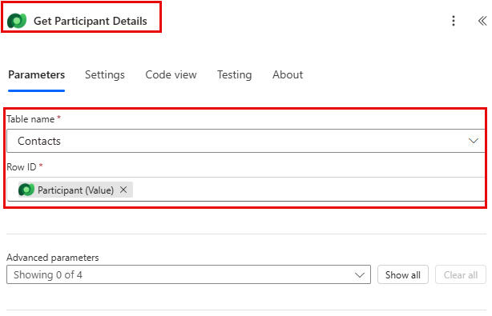
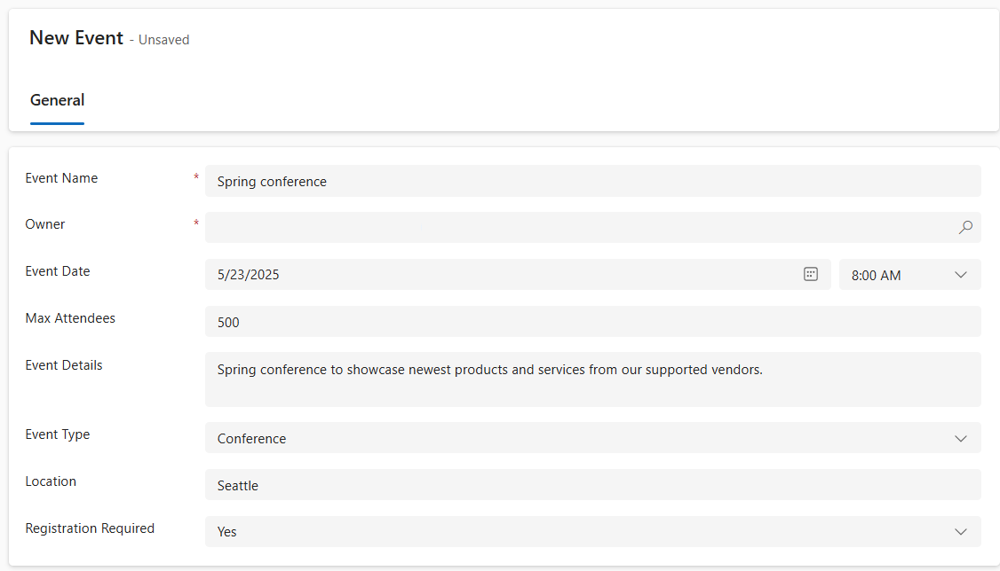

---
lab:
  title: "Labo\_6\_: Créer un flux Power Automate."
  learning path: 'Learning Path: Demonstrate the capabilities of Microsoft Power Automate'
  module: 'Module 2: Build a Microsoft Power Automate flow'
---

## Objectif d’apprentissage

Dans cet exercice, les apprenants créent une série de flux cloud différents à l’aide de Microsoft Copilot dans Power Automate. Vous utiliserez différentes méthodes de création, comme Copilot et à partir de zéro, pour mieux connaître les différentes options disponibles.

À l’issue de cet exercice, vous pourrez :

- Utiliser des invites en langage naturel pour créer des flux de travail
- Configurer des déclencheurs et des actions
- Testez l’automatisation pour une utilisation pratique.

### Scénario

Contoso Consulting est une organisation de services professionnels spécialisée dans les services de conseil en informatique et en IA Tout au long de l’année, Contoso Consulting propose de nombreux événements différents à leurs clients. Il s’agit notamment de salons professionnels au cours desquels de nombreux partenaires viennent fournir des informations sur les nouveaux produits, les tendances du marché et les services. D’autres ont lieu tout au long de l’année et sont des webinaires rapides qui servent à fournir des détails sur des produits individuels. De plus, Contoso commence à utiliser des agents automatisés pour aider les clients à trouver des réponses à leurs questions.

Contoso souhaite utiliser Power Automate pour créer un flux de confirmation d’inscription qui enverra un e-mail automatisé à un client lorsqu’il s’inscrit à un événement. 

Dans cet exercice, vous allez créer une série de flux Power Automate en fonction de critères spécifiques.

Avant de commencer cet exercice, vous devez avoir effectué les laboratoires suivants :

- **Lab 2 – Créer un modèle de données**
- **Labo 5 : Créer une application pilotée par modèle**

## Exercice 1 : Créer un flux de notification d’inscription de session

Dans ce premier exercice, vous allez créer un flux qui s’exécutera automatiquement lors de la création d’une nouvelle inscription de session. Il récupérera les détails de la session, de l’événement et du contact qui s’est inscrit, puis enverra un e-mail à cette adresse avec les détails de l’inscription.

### Tâche 1 : Créer un flux

Nous voulons envoyer une confirmation d’inscription à tous les utilisateurs nouvellement inscrits. Nous allons créer un flux qui capture les détails d’une inscription et envoie un e-mail de confirmation à l’utilisateur inscrit.

1. Accédez à [https://make.powerautomate.com](https://make.powerautomate.com/).

2. Vous devrez peut-être vous réauthentifier. Sélectionnez **Se connecter** et suivez les instructions si nécessaire.

3. Sélectionnez l’environnement **Dev One** en haut à droite, si ce n’est pas déjà fait. (Important : n’oubliez pas d’effectuer cette étape).

4. Sélectionnez **Créer** dans la navigation de gauche. (Si vous y êtes invité, sélectionnez **Démarrage**.)

5. Sélectionnez **+ Nouveau flux**, puis sélectionnez **Flux cloud automatisé**.

6. Entrez la **Notification d’inscription** dans **Nom du flux**.

7. Sous **Choisir le déclencheur de votre flux**, recherchez **Dataverse**.

8. Choisissez le déclencheur **Quand une ligne est ajoutée, modifiée ou supprimée**, puis sélectionnez **Créer**.

    Si vous voyez une erreur **Paramètres non valides**, cela est dû au fait que vous n’avez pas authentifié. Suivez la procédure ci-dessous pour créer une connexion. 
    - Sélectionner **Modifier la connexion**.
    - sélectionnez **Ajouter nouveau.*
    - Dans le champ **Nom de la connexion**, entrez **Administrateur **MOD. Laissez le **Type d’authentification** défini sur **OAuth**, puis **Sélectionnez Se connecter**.
    - Une fois connecté, passez à l’**étape 9.** 

9. Remplissez les conditions du déclencheur pour le flux :

    - Sélectionner **Ajouté** pour **Type de modification**
    - Sélectionnez **Inscriptions à la session** dans le champ **Nom de la table.**
    - Sélectionnez **Organisation** dans **Étendue** à l’étape du déclencheur, sélectionnez les points de suspension (**...**), puis sélectionnez **Renommer**. 

10. Renommez l’étape du déclencheur **Lors de l’ajout d’une inscription de session.**

Il s’agit d’une bonne pratique, qui vous permet, ainsi que d’autres éditeurs de flux, de comprendre le but de l’étape sans devoir vous plonger dans les détails.

### Tâche 2 : Créez une étape pour obtenir les détails de la session Événement pour laquelle l’inscription est activée.

1. Sélectionnez **+ Nouvelle étape**. 

2. Recherchez **Obtenir une ligne par ID**. 

3. Sélectionnez l’action **Obtenir une ligne par ID**.

4. Sélectionner **sessions Événement** comme **Nom de la table**

5. Sélectionnez le champ **ID de ligne** . Notez que les icônes s’affichent pour sélectionner **Contenu dynamique** ou **Expressions**.

6. Dans le champ **ID de ligne**, sélectionnez **Session Événement (valeur)** dans la liste **Contenu dynamique**. Dans cette étape, vous recherchez la **Session Événement** dans **Inscription de session** créée pour déclencher ce flux.

7. Dans l’action **Obtenir une ligne par ID**, sélectionnez les points de suspension ( **...** ), puis **Renommer**. Renommer cette action **Obtenir la session Événement**

Ensuite, nous allons obtenir les détails de l’événement dans lequel se trouve la session.

8. Sous l’étape **Obtenir la session Événement**, sélectionnez **+ Insérer une action.**

9. Recherchez **Obtenir une ligne par ID**. 

10. Sélectionnez l’action **Obtenir une ligne par ID**.

11. Sélectionner **Événement** comme **Nom de la table**

12. Sélectionnez le champ **ID de ligne** . Notez que les icônes s’affichent pour sélectionner **Contenu dynamique** ou **Expressions**.

13. Dans le champ **ID de ligne**, sélectionnez **Événement (valeur)** dans la liste **Contenu dynamique**. Dans cette étape, vous recherchez **Événement** dans la **Session d’événement** capturée à l’étape précédente.

14. Dans l’action **Obtenir une ligne par ID**, sélectionnez les points de suspension ( **...** ), puis **Renommer**. Renommez cette action **Obtenir l’événement.**

Enfin, nous allons obtenir les détails de la personne inscrite pour la session.

15. Sous Obtenir les détails de l’événement, définissez l’option **Insérer une nouvelle action**.

16. Dans le champ de recherche, entrez **Obtenir une ligne par ID**.

17. Sélectionnez **Obtenir une ligne par ID**.

18. Sélectionnez **Contacts** comme **Nom de table**.

19. Sélectionnez le champ **ID de ligne** . Notez qu’une fenêtre s’ouvre pour vous permettre de sélectionner **Contenu dynamique** ou **Expressions**.

20. Dans le champ **ID de ligne**, sélectionnez le champ **Participant (Valeur)** dans le déclencheur **Lorsqu’une inscription de session est ajoutée** à partir de la liste **Contenu dynamique**.

21. Sélectionnez le texte **Obtenir une ligne par ID** et renommez cette action **Obtenir** les **Détails du participant**.

### Tâche 3 : Créer une étape pour envoyer un e-mail pour confirmer l’inscription de session

1. Sous l’étape **Obtenir les détails du participant**, sélectionnez**Insérer une nouvelle action**.

2. Dans le champ de recherche, entrez **Envoyer un e-mail**.

3. Sélectionnez l’action **Envoyer un e-mail (V2)**.

Vous serez peut-être invité à créer une connexion à Outlook. Si tel est le cas, sélectionnez le bouton **Se connecter** et connectez-vous avec le compte **Administrateur Mod**. 

4. Juste au-dessus du champ **À**, sélectionnez l’icône **Engrenage**. Dans le menu qui s’affiche, sélectionnez **Utiliser le contenu dynamique**.

 

5. À l’aide de valeurs dynamiques, dans le **champ À**, sélectionnez **E-mail** sous **Obtenir les détails du participant**.

6. Dans le champ **Objet**, assurez-vous qu’il indique confirmation de l’inscription.

7. Entrez le texte suivant dans le **Corps du courriel**.

> **Remarque :** Le contenu dynamique doit être placé là où les champs sont nommés entre crochets. Il est recommandé de commencer par copier et coller l’ensemble du texte, puis d’ajouter du contenu dynamique aux endroits appropriés.

  *Cher {Prénom}, merci de vous inscrire à notre prochaine session {Nom de session} sur {Date de l’événement}. {Intervenant} sera votre intervenant dans cette session. Votre session devrait durer {Durée (heures)}. Consultez notre autre session à notre {Nom de l’événement}.*

  *Cordialement,*

  *Administration des événements*
  
  *Contoso Consulting*

Ensuite, nous allons remplacer le texte entre parenthèses par les éléments décrits ci-dessous.

8. Mettez en surbrillance le texte **{First Name}** . Remplacez-le par le champ **Prénom** à partir de l’étape **Obtenir les détails du participant**.

9. Mettez en surbrillance le texte **{Nom de session}**. Remplacez-le par le champ **Nom de la session** de l’étape **Obtenir la session Événement**.

10. Mettez en surbrillance le texte **{Date de l’événement}**. Remplacez-le par le champ **Date de l’événement** à partir de l’étape **Obtenir les détails de l’événement**.

11. Mettez en surbrillance le texte **{Intervenant}**. Remplacez-le par le champ **Intervenant (Valeur)** de l’étape **Obtenir la session Événement**.

12. Mettez en surbrillance le texte **{Durée (Heures)}**. Remplacez-le par le champ **Durée (Heures)** de l’étape **Obtenir la session Événement**.

13. Mettez en surbrillance le texte **{Nom de l’événement}**. Remplacez-le par le champ **Nom de l’événement** à partir de l’étape **Obtenir les détails de l’événement**.

Une fois cette étape terminée, le résultat devrait ressembler à l’image suivante :

14. Cliquez sur **Enregistrer**.

Laissez cet onglet de flux ouvert pour la tâche suivante. Votre flux doit ressembler à ceci :

### Tâche 4 : Entrez des exemples de données

> **Remarque :** Si vous avez terminé Lab 5 – Créer une application basée sur un modèle, vous pouvez ignorer cette tâche et passer directement à la tâche 5. 

1. Dans le volet de navigation de gauche, sélectionnez **Applications**.

2. Modifiez les applications affichées en passant de **Mes applications** à**Tous**.

3. Placez le curseur sur l’application **Gestion d’événement** et sélectionnez l’icône **Lecture**.

4. À l’aide du menu de navigation à gauche, sélectionnez **Contacts**.

5. Dans la barre de commandes, sélectionnez le bouton **+ Nouveau**.

6. Dans l’écran **Nouveau contact**, configurez comme suit :

    - **Prénom :** Suzanne

    - **Nom :** Diaz

    - **Fonction :** Ingénieur

7. Dans l’en-tête du formulaire, sélectionnez la flèche vers le bas à côté de **Type de contact**.

8. Définissez le **Type de contact** sur **Intervenant**.

9. Sélectionnez le bouton **Enregistrer** pour enregistrer le contact et laissez-le ouvert.

10. Sélectionner le bouton **+ New**.

11. Dans l’écran **Nouveau contact**, configurez comme suit :

    - **Prénom :** Edgar

    - **Nom :** Swenson

    - **Fonction :** Architecte

    - **E-mail :** Entrez votre adresse e-mail (IMPORTANT ou votre flux ne s’exécutera pas)

12. Dans l’en-tête du formulaire, sélectionnez la flèche vers le bas à côté de **Type de contact**.

13. Définissez le **Type de contact** sur **Participant**.

14. Cliquez sur le bouton **Enregistrer et fermer**.

Nous allons ensuite ajouter un nouvel événement.

15. Dans le volet de navigation de gauche, sélectionnez **Événements**.

16. Dans la barre de commandes, sélectionnez le bouton **+ Nouveau**.

17. Dans l’écran **Nouvel événement**, configurez comme suit :

    - **Event-Name :** Conférence de printemps.

    - **Date de l’événement :** Date de demain

    - **Nombre maximal de participants :** 500

    - **Détails de l’événement :** Conférence de printemps pour présenter les derniers produits et services de nos fournisseurs agréés.

    - **Type d’événement ** Conférence

    - **Emplacement :** Seattle

    - **Inscription requise :** Oui/Vrai

18. Cliquez sur le bouton **Enregistrer et fermer**.

Ensuite, nous allons ajouter une nouvelle session pour l’événement.

19. À l’aide de la navigation à gauche, sélectionnez **Sessions Événement**.

20. Sélectionner le bouton **+ New**.

21. Configurez la **Session d’événement** comme suit :

    - **Nom de la session :** IA responsable

    - **Date de la session :** Date de demain

    - **Durée :** 1 heure et demie

    - **Description de la session :** Avec toutes les nouvelles solutions d’IA, il est important d’agir de manière responsable. Nous discuterons des défis à relever.

    - **Intervenant :** Suzanne Diaz

    - **Événement :** Conférence de printemps

22. Sélectionnez le bouton **Enregistrer et fermer**.

 
### Tâche 5 : Valider et tester le flux

1. Si nécessaire, ouvrez un nouvel onglet dans votre navigateur, puis accédez à [https://make.powerapps.com](https://make.powerapps.com/). 

2. Sélectionnez l’environnement **Dev One** en haut à droite, si ce n’est pas déjà fait.

3. Sélectionnez **Applications** et ouvrez l’application **Gestion d’événement Contoso**.

4. En laissant cet onglet de navigateur ouvert, revenez à l’onglet précédent avec votre flux.

5. Dans la barre de commandes, sélectionnez **Tester**. Sélectionnez **Manuellement**, puis **Tester**.

6. Accédez à l’onglet du navigateur en ayant votre application pilotée par modèle ouverte.

Enfin, nous allons créer une **Inscription de session**.

7. À l’aide de la navigation à gauche, sélectionnez **Inscriptions à la session.**

8. Sélectionnez **+ Nouveau** dans la **Barre de commandes**.

9. Terminez l’inscription de session comme suit :

    - **Nom :** Inscription E, Swenson.

    - **Date d’inscription :** Date du jour

    - **Participant :** Edgar Swenson

    - **Session :** IA responsable

10. Sélectionnez le bouton **Enregistrer et fermer**.

11. Cliquez sur le bouton **Enregistrer et fermer**.

12. Accédez à l’onglet du navigateur où votre test de flux est en cours d’exécution. Après un court délai, vous devez voir le flux en cours d’exécution. C'est là que vous pouvez détecter tout problème dans le flux ou confirmer qu’il s'est bien déroulé.

Après un court instant, vous devriez voir un e-mail dans votre boîte de réception.

> **Remarque :** Cet e-mail peut se retrouver dans votre dossier Courrier indésirable.
