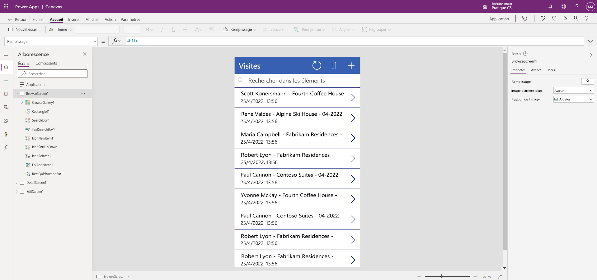

---
lab:
  title: 'Labo 3 : Comment créer une application canevas'
  module: 'Module 3: Get started with Power Apps'
ms.openlocfilehash: 0ac0874e80deb74b8a4cf0c8075adf6c9b14e375
ms.sourcegitcommit: fc79a9b68a8235b37fd90ef84ba8ae1aa2e581f5
ms.translationtype: HT
ms.contentlocale: fr-FR
ms.lasthandoff: 04/30/2022
ms.locfileid: "144424763"
---
# Module 3 : Bien démarrer avec Power Apps
## Labo 1 : Comment créer une application canevas

# Scénario

Bellows College est une organisation éducative disposant de plusieurs bâtiments sur le campus. Les visites sur le campus sont actuellement enregistrées dans des journaux papier. Les informations ne sont pas saisies de manière cohérente et il n’y a aucun moyen de collecter ni d’analyser les données concernant les visites sur l’ensemble du campus.

Actuellement, l’administration du campus utilise une feuille de calcul Excel pour suivre l’inscription des visiteurs. Elle souhaite moderniser son système d’inscription des visiteurs où l’accès aux bâtiments est contrôlé par le personnel de sécurité et toutes les visites doivent être pré-enregistrées et enregistrées par leurs hôtes.

Tout au long de ce cours, vous créerez des applications et effectuerez une automatisation pour permettre au personnel administratif et de sécurité du Bellows College de gérer et de contrôler l’accès aux bâtiments du campus.

# Étapes de labo de haut niveau

Nous allons suivre le plan ci-dessous pour concevoir l’application canevas :

-   Créer une application canevas à partir de données dans la table Visite

-   Configurer l’affichage des visites sur l’écran de navigation

-   Apporter des modifications de base à l’application

-   Tester les fonctionnalités de l’application

## Prérequis

-   Participation au **Module 0 - Labo 0 : Valider l’environnement de labo**

# Exercice \#1 : Créer l’application Visites

**Objectif** : Dans cet exercice, vous allez créer une application canevas en connectant la table Visites Initiales que vous avez créée précédemment.

## Tâche \#1 : Créer une application Visites

1.  Accédez à <https://make.powerapps.com>. Vous devrez peut-être vous authentifier à nouveau. Cliquez sur **Se connecter** et suivez les instructions si nécessaire.

2.  Sélectionnez votre environnement **Exercices pratiques [mes initiales]** en haut à droite, si ce n’est déjà fait.

3.  Si nécessaire, cliquez sur l’icône **Accueil** à droite de l’écran. Sous la section **Démarrer à partir de**, sélectionnez **Dataverse**.

4.  Sélectionnez votre connexion Dataverse. 

>   **REMARQUE :** *Si une connexion Dataverse n’existe pas :*
>   -   Sélectionnez **Nouvelle connexion**.
>   -   Localisez **Microsoft Dataverse**.
>   -   Cliquez sur **Créer**

5.  Recherchez et sélectionnez la table **Visites** que vous avez créée dans le labo précédent.

6.  Sélectionnez le bouton **Connexion**.

7.  Une fois votre application créée, dans l’écran Bienvenue de Power Apps Studio, cochez la case **Ne plus afficher ce message**, puis sélectionnez **Ignorer**.

8.  Une fois l’application créée, elle doit ressembler à l’image ci-dessous.

Félicitations, vous avez créé une application Power Apps à partir d’une table Dataverse. L’étape suivante du processus consiste à personnaliser l’application pour refléter la stratégie de marque de votre établissement. La série suivante d’étapes vous guidera tout au long des tâches nécessaires pour personnaliser davantage l’application.

## Tâche \#2 : Modifier l’application nouvellement créée et lui appliquer un thème

1.  Sélectionnez le nom de l’application, **Visites**.

3.  À droite de l’écran, sous l’onglet Propriétés, remplacez la propriété du contrôle  **Texte** par « **Visites de Bellows College** ».

4. Dans les propriétés, définissez la **Taille de police** sur **24**.

4.  Dans le volet de navigation de gauche, sélectionnez **DetailsScreen1**.

5.  Sélectionnez le titre **Visites**.

6.  À droite de l’écran, sous l’onglet Propriétés, remplacez la propriété du contrôle  **Texte** par « **Détails de la visite** ».

7.  Dans le volet de navigation de gauche, sélectionnez **EditScreen1**.

8.  Sélectionnez le titre **Visites**.

9.  À droite de l’écran, sous l’onglet Propriétés, remplacez le texte Table1 dans la propriété du contrôle  **Texte** par « **Modifier les détails** ».

10. Dans le volet de navigation de gauche, sélectionnez **BrowseScreen1**.

11. Dans la barre d’outils de commande, sélectionnez le bouton **Thème** et, dans la liste qui s’affiche, sélectionnez la couleur de thème **Rouge**.

## Tâche \#3 : Tester l’application Visites

Dans cette tâche, vous allez configurer un formulaire pour modifier les informations sur les visites individuelles.

1.  Ouvrez votre application dans le Concepteur d’application, sélectionnez **Fichier**, remplacez le nom de votre application par **Application Visites**, puis sélectionnez **Enregistrer**.

2.  Une fois l’application enregistrée, utilisez la flèche **Précédent** pour revenir à votre application.

3.  Dans le Concepteur d’application, sélectionnez le bouton de **prévisualisation de l’application** (icône Lecture) dans la barre de commandes. *(Vous pouvez également appuyer sur la touche F5 de votre clavier pour prévisualiser l’application.)*

4.  Une fois l’application ouverte, dans le champ **Éléments de recherche**, entrez le texte **Maria**
     *(Notez la façon dont les éléments de la galerie sont filtrés en fonction de ce que vous tapez dans le champ de recherche.)*

5.  Quand l’enregistrement **Contoso Suites** pour **Maria Campbell** s’affiche, cliquez sur la **flèche droite** de l’enregistrement pour accéder à l’écran **Détails de la visite**. (**Remarque** : *Si plusieurs enregistrements Contoso Suites pour Maria Campbell sont affichés, sélectionnez-en un.* )

6.  Pour modifier l’enregistrement, sélectionnez l’**icône crayon** dans le coin supérieur droit de l’application.

7.  En haut de l’écran, cliquez sur l’icône **X** pour revenir à l’écran **Détails de la propriété**.

8.  Cliquez sur la **flèche gauche** pour revenir à l’écran Parcourir.

9. Sélectionnez **Fichier**, puis **Enregistrer**.

10. Sélectionnez **Publier**.

# Défis

-   Ajoutez les colonnes suivantes aux formulaires dans DetailScreen1 et EditScreen1 : Début réel, Fin réelle, Code, Début prévu et Fin prévue
