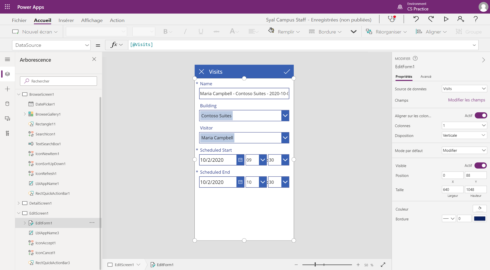
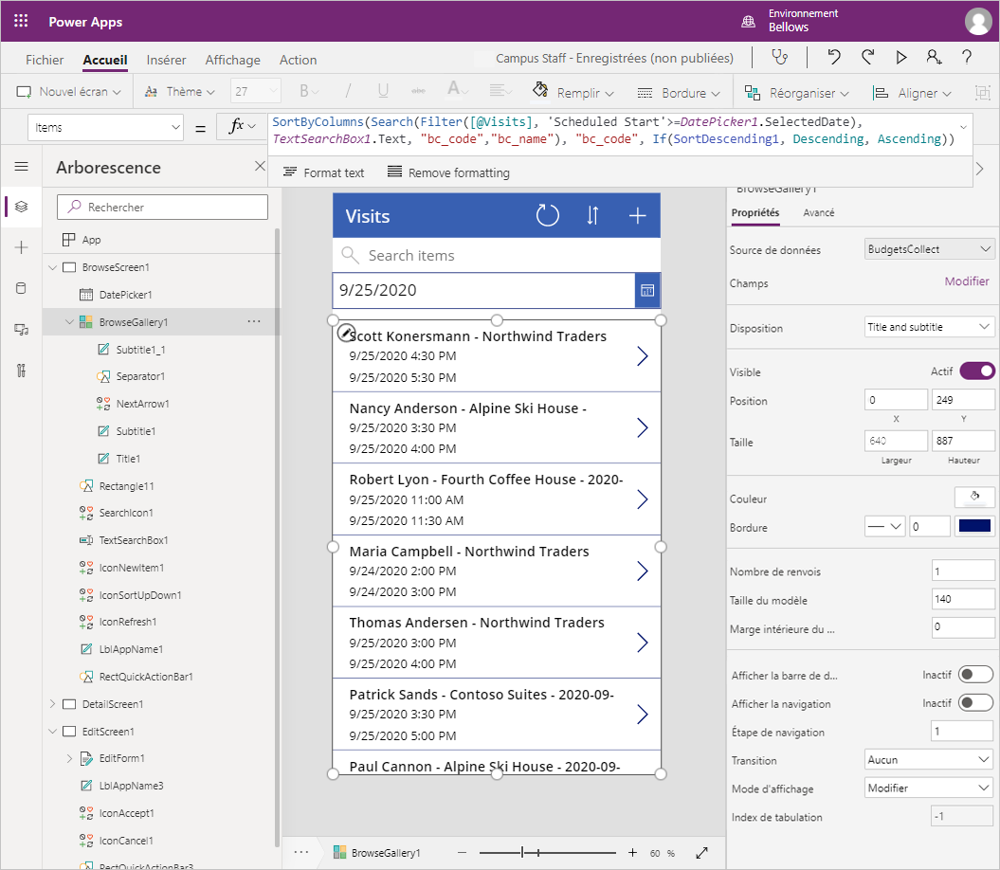

---
lab:
    title: 'Labo 2 : Comment créer une application canevas, partie 1'
    module: 'Module 3 : Premiers pas avec Power Apps'
---

# Module 3 : Premiers pas avec Power Apps

## Labo : Comment créer une application canevas, partie 1

# Scénario

Bellows College est une organisation éducative disposant de plusieurs bâtiments sur le campus. Les visites sur le campus sont actuellement enregistrées dans des journaux papier. Les informations ne sont pas saisies de manière cohérente et il n’y a aucun moyen de collecter ni d’analyser les données concernant les visites sur l’ensemble du campus. 

L’administration du campus souhaite moderniser son système d’inscription des visiteurs où l’accès aux bâtiments est contrôlé par le personnel de sécurité et toutes les visites doivent être pré-enregistrées et enregistrées par leurs hôtes.

Tout au long de ce cours, vous créerez des applications et effectuerez une automatisation pour permettre au personnel administratif et de sécurité du Bellows College de gérer et de contrôler l’accès aux bâtiments du campus.  

Dans la première partie de ce labo, vous allez créer une application canevas Power Apps qui permettra au personnel de l’université de gérer les visites de ses invités.

# Étapes de labo de haut niveau

Nous allons suivre le plan ci-dessous pour concevoir l’application canevas :

-   Créez l’application depuis des données à l’aide du modèle de facteur de forme du téléphone.
-   Configurez une page de détails des informations sur les visites.
-   Configurez une page de modification à créer pour les visites.
-   Configurez un contrôle de galerie pour afficher les visites.
-   Ajoutez un filtrage sur la source de données de la galerie pour n’afficher que les futures visites.

## Prérequis

* Achèvement du **Module 0 - Labo 0 : Valider l’environnement de labo**
* Achèvement du **Module 2 - Labo 1 : Présentation de Microsoft Dataverse**

## Éléments à considérer avant de commencer

-   Quel est le facteur de forme le plus répandu pour le public cible ?
-   Estimer le nombre d’enregistrements dans le système 
-   Comment réduire les enregistrements sélectionnés pour améliorer les niveaux de performance de l’application et l’adoption par les utilisateurs

# Exercice \#1 : Créer une application canevas du personnel

**Objectif :** Dans cet exercice, vous allez créer une application canevas à partir d’un modèle, puis la modifier pour y inclure les données requises.

## Tâche \#1 : Créer une application canevas

Dans cette tâche, vous allez créer une application canevas à l’aide du modèle de disposition du téléphone basé sur Microsoft Dataverse. L’utilisation de Visites comme table sélectionnée depuis Dataverse permettra au modèle de générer l’application Galerie - Afficher - Éditer pour gérer les visites sur le campus.

1.  Lancez la création d’une application à partir de données

    -   Connectez-vous à <https://make.powerapps.com>

    -   Sélectionnez votre **environnement** en haut à droite, s’il n’est pas déjà défini sur
        votre environnement Exercices pratiques.

    -   Sélectionnez l’icône **Dataverse** avec l’option **Start from data** dans l’écran d’accueil.

2.  Connectez-vous à votre table Visits
    
    -   Sélectionnez **+ Nouvelle connexion**

    -   Sélectionnez **Microsoft Dataverse** et cliquez sur **Créer**

    -   Localisez et sélectionnez votre table **Visits**

    -   Sélectionnez **Se connecter**

3.  Il est possible que la fenêtre **Bienvenue dans Power Apps Studio** apparaisse. Cliquez sur **Ignorer**.

4.  Enregistrer l’application

    -   Cliquez sur **Fichier \> Enregistrer**.

    -   Entrez [Your Last Name] Personnel du campus dans le champ **Nom de l’application**.

    -   Sélectionnez **Enregistrer**.

## Tâche \#2 : Configurer le formulaire de détails des visites

Dans cette tâche, vous allez configurer le formulaire de détails pour afficher les informations sur les enregistrements de visite individuelle.

1. Sélectionnez la flèche **Retour**, en haut à gauche, pour revenir à la définition de l’application.

2. Développez **DetailScreen1** sous **Arborescence**.

3.  Sélectionnez **DetailForm1**.

4.  Sélectionnez **Modifier les champs** en regard de la zone **Champs** dans le volet de droite.

5.  Cliquez sur **Ajouter un champ**.

6.  Sélectionnez les champs suivants :

    * Fin réelle
    
    * Début réel
    
    * Bâtiment 
    
    * Code
    
    * Scheduled End
    
    * Scheduled start
    
    * Visiteur
    
7.  Cliquez sur **Ajouter**.

8.  Réorganisez les champs dans le volet **Champs** en glissant et déposant les noms de champs vers le haut ou vers le bas. L’ordre recommandé est le suivant :
    * Code, nom, bâtiment, visiteur, début planifié, fin planifiée, début réel, fin réelle
    >**Astuce :** Vous pouvez réduire l’ensemble des champs en cliquant sur la flèche pointant vers le bas en regard du nom du champ.

9.  Pour supprimer le champ **Créé le**, cliquez sur les points de suspension (**…**) en regard du nom du champ, puis sélectionnez **Supprimer**. 

10.  Fermez le volet **Champs**.
 
11.  Pour conserver le travail en cours, cliquez sur **Fichier**, puis sur **Enregistrer**. Utilisez la flèche retour pour revenir à l’application.

## Tâche \#3 : Configurer le formulaire de modification des visites

Dans cette tâche, vous allez configurer un formulaire pour modifier les informations sur les lignes de visites individuelles.

1.  Développez **EditScreen1** sous **Arborescence**.

2.  Sélectionnez **EditForm1**.

3.  Sélectionnez le champ **Créé le**, puis appuyez sur la touche **Suppr** pour supprimer le champ.

4.  Sélectionnez **Modifier les champs** dans le panneau des propriétés.

5.  Cliquez sur **Ajouter un champ**.

6.  Sélectionnez les champs suivants :

    * Bâtiment 
    
    * Scheduled End
    
    * Scheduled start
    
    * Visiteur
    
7.  Cliquez sur **Ajouter**.

8.  Réorganisez les champs dans le volet **Champs** en glissant et déposant les noms de champs vers le haut ou vers le bas. L’ordre recommandé est le suivant :
    
    * Nom, bâtiment, visiteur, début planifié, fin planifiée
    >**Astuce :** Vous pouvez réduire l’ensemble des champs en cliquant sur la flèche pointant vers le bas en regard du nom du champ. 

9.  Fermez le volet **Champs**.

10.  Pour conserver le travail en cours, cliquez sur **Fichier**, puis sur **Enregistrer**. Utilisez la flèche retour pour revenir à l’application.

Votre écran doit plus ou moins ressembler à ceci :



## Tâche \#4 : Configurer la galerie de visites

Dans cette tâche, vous allez configurer la galerie prégénérée pour afficher le titre et les dates de début et de fin de la visite. 

1.  Développez **BrowseScreen1** sous **Arborescence**.

2.  Sélectionnez **BrowseGallery1**.

3.  Sélectionnez la propriété **TemplateSize** dans le volet droit du panneau Propriétés avancées.

4.  Remplacez l’expression par la suivante `Min(150, BrowseGallery1.Height - 60)`. Cette action garantit un espace suffisant pour des informations supplémentaires.

5.  Dans la prévisualisation de l’application, sélectionnez le premier champ Date et heure de la galerie.

6.  Dans la partie supérieure de la barre de formule, remplacez **« ThisItem.'Created On' »** par `ThisItem.'Scheduled Start'`.

7.  Sélectionnez à nouveau le champ.

8.  Appuyez sur **CTRL+C**, puis sur **CTRL+V** pour créer une copie du champ.

9.  À l’aide de la souris ou du clavier, déplacez le contrôle copié vers le bas et alignez-le avec les autres contrôles dans la galerie, sous le champ Date et heure.

10.  Dans la partie supérieure de la barre de formule, remplacez **ThisItem.'Scheduled Start'** par `ThisItem.'Scheduled End'`.

11.  Pour conserver le travail en cours, cliquez sur **Fichier**, puis sur **Enregistrer**. Utilisez la flèche retour pour revenir à l’application.

## Tâche 5 : Ajouter un filtre de date

Étant donné que le nombre de visites augmente continuellement, les utilisateurs ont besoin d’une fonctionnalité pour filtrer la galerie de visites. Par exemple, l’utilisateur peut souhaiter consulter uniquement les visites futures. Dans cette tâche, vous ajoutez la possibilité d’afficher uniquement les visites ultérieures à une date sélectionnée par l’utilisateur.

1. Sélectionnez **BrowseScreen1**.

2. Sélectionnez le menu **Insérer** en haut.

3. Cliquez sur **Entrée** et sélectionnez **Sélecteur de date**.

4. À l’aide du clavier ou de la souris, positionnez le contrôle sous le champ de recherche.

5. Sélectionnez **BrowseGallery1**. 

6. Redimensionnez et déplacez le contrôle de galerie pour qu’il se trouve sous le sélecteur de date et recouvre l’écran. Pour ce faire, cliquez sur l’icône de redimensionnement en haut au centre du contrôle de galerie et redimensionnez-en le contrôle pour qu’il commence après le sélecteur de date.

7. Tout en maintenant **BrowseGallery1** sélectionné, cliquez sur l’onglet **Avancé** dans le volet Propriétés.

8. Localisez la propriété **Articles** et cliquez dans la zone de texte.

9. Dans l’expression, recherchez **[@Visits]** et remplacez cette valeur par `Filter(Visits,'Scheduled End' >= DatePicker1.SelectedDate)`. L’expression complète doit ressembler à ce qui suit :

   ```
   SortByColumns(
   	Search(
        Filter(
        	Visits,
            'Scheduled End' >= DatePicker1.SelectedDate
           ),
           TextSearchBox1.Text,
       	"bc_code","bc_name"
       ),
     "bc_scheduledstart",
     If(SortDescending1, Descending, Ascending)
   )
   ```
   
10. Pour conserver le travail en cours, cliquez sur **Fichier**, puis sur **Enregistrer**. Utilisez la flèche retour pour revenir à l’application.

Votre écran doit plus ou moins ressembler à ceci :



# Exercice n° 2 : Finaliser l’application

Au cours de cet exercice, vous testerez l’application. Si elle fonctionne comme prévu, vous l’ajoutez ensuite à votre solution.

## Tâche \#1 : Tester l’application

1.  Démarrer l’application

    -   Sélectionnez **BrowseScreen1** et appuyez sur la touche de fonction **F5**, ou cliquez sur l’icône **Lire** dans le coin supérieur droit pour afficher un aperçu de l’application.
    
    -   L’application doit se charger et afficher la liste des visites. 
    
    -   Testez le filtre en sélectionnant différentes dates dans le contrôle du sélecteur de dates.
    
    -   Sélectionnez une visite et vérifiez que le formulaire d’affichage fonctionne correctement.
    
    -   Retournez dans la galerie et appuyez sur **+** pour créer une nouvelle visite. Vérifiez que le formulaire de modification contient les colonnes obligatoires, y compris le visiteur, le bâtiment, les dates de début et de fin prévues.
    
    -   Renseignez les informations avant l’envoi. Vérifiez que le nouvel enregistrement apparaît dans la galerie.
    
    -   Créez au moins 2 visites supplémentaires.
    
    -   Appuyez sur la touche **Échap** ou cliquez sur l’icône **X** pour fermer le mode aperçu.

2.  Enregistrer et publier l’application

    -   Cliquez sur **Fichier** et, si le bouton Enregistrer est affiché, cliquez sur **Enregistrer**.

    -   Cliquez sur **Publier**.

    -   Cliquez sur **Publiez cette version**.

    -   Cliquez sur la flèche **Retour** pour revenir à l’application.

    -   Fermez l’onglet ou la fenêtre du navigateur du **Concepteur**.

    -   Cliquez sur **Quitter** si vous y êtes invité lorsque vous essayez de fermer la fenêtre du navigateur.

## Tâche n° 2 : Ajouter une application à la solution et publier 

1. Ouvrez la solution Gestion du campus.

   * Connectez-vous à <https://make.powerapps.com>.
   
   * Si l’environnement affiché en haut à droite n’est pas votre environnement de pratique, sélectionnez-en un dans la liste **Environnement**. 
   
   * Sélectionnez **Solutions**.
   
   * Cliquez pour ouvrir votre solution de **Gestion du campus**.
   
2. Sélectionnez **Ajouter existant**, cliquez sur **Application** puis cliquez sur **Application canevas**.

3. Sélectionnez l’onglet **Outside Dataverse**

4. Sélectionnez votre application **Personnel du campus** puis cliquez sur **Ajouter**.

5. Sélectionnez **Publier toutes les personnalisations**.

# Défis

* Affichage du calendrier de toutes les visites et filtrage par plage de dates
* Possibilité de créer et de gérer des contacts dans le cadre de l’application
* Comment afficher plusieurs réunions lors d’une seule visite

