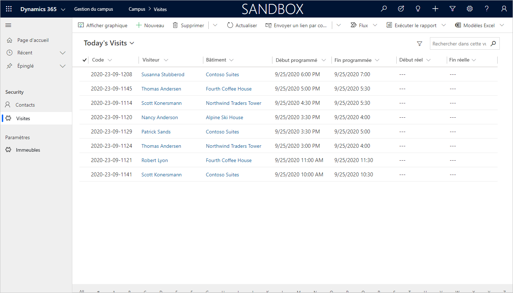

---
lab:
  title: 'Labo 4 : Comment créer une application pilotée par modèle'
  module: 'Module 3: Get started with Power Apps'
ms.openlocfilehash: e0fcc3a12bb54b7fca08e41599d999b3e38eee23
ms.sourcegitcommit: ef58c858463b890e923ef808b1d43405423943fd
ms.translationtype: HT
ms.contentlocale: fr-FR
ms.lasthandoff: 01/27/2022
ms.locfileid: "137898981"
---
# Module 3 : Bien démarrer avec Power Apps
## Labo 3 : Comment créer une application pilotée par modèle

# Scénario

Bellows College est une organisation éducative disposant de plusieurs bâtiments sur le campus. Les visiteurs du campus sont actuellement enregistrés dans des journaux papier. Les informations ne sont pas saisies de manière cohérente et il n’y a aucun moyen de collecter ni d’analyser les données concernant les visites sur l’ensemble du campus. 

L’administration du campus souhaite moderniser son système d’inscription des visiteurs où l’accès aux bâtiments est contrôlé par le personnel de sécurité et toutes les visites doivent être pré-enregistrées et enregistrées par leurs hôtes.

Tout au long de ce cours, vous créerez des applications et effectuerez une automatisation pour permettre au personnel administratif et de sécurité du Bellows College de gérer et de contrôler l’accès aux bâtiments du campus. 

Dans ce labo, vous allez créer une application Power Apps pilotée par modèle pour permettre au personnel de bureau du campus de gérer les enregistrements de visites sur l’ensemble du campus.

# Étapes de labo de haut niveau

Dans le cadre de la création de l’application basée sur un modèle, vous effectuerez les opérations suivantes :

-   Créer une nouvelle application pilotée par modèle nommée Gestion du campus

-   Modifier la navigation de l’application pour référencer les tables requises

-   Personnaliser les formulaires et les vues des tables requises pour l’application

Nous travaillerons avec les composants suivants :

- **Vues** : Les vues permettent à l’utilisateur d’afficher les données existantes dans la table des formulaires.

- **Formulaires** : C’est là que l’utilisateur crée ou met à jour de nouvelles lignes dans les tables.

Les deux seront intégrés à l’application basée sur un modèle, pour une meilleure expérience utilisateur.

## Prérequis

* Participation au **Module 0 - Labo 0 : Valider l’environnement de labo**
* Participation au **Module 2 - Labo 1 : Présentation de Microsoft Dataverse**

## Éléments à considérer avant de commencer

-   Quels changements devons-nous apporter pour améliorer l’expérience utilisateur ?

-   Que devrions-nous inclure dans une application pilotée par modèle d’après le modèle de données que nous avons créé ?
    
-   Quelles personnalisations peuvent être effectuées sur le plan du site d’une application pilotée par modèle ?

# Exercice \#1 : Personnaliser les vues et les formulaires

**Objectif** : Au cours de cet exercice, vous apprendrez à personnaliser les vues et les formulaires des tables personnalisées qui seront utilisées dans l’application pilotée par modèle.

## Tâche \#1 : Modifier le formulaire de visite

1.  Connectez-vous à <https://make.powerapps.com> si vous n’êtes pas encore connecté.

2.  Sélectionnez votre **environnement**.

3.  Sélectionnez **Solutions**.

4.  Cliquez pour ouvrir votre solution de **Gestion du campus**.

5.  Cliquez pour ouvrir l’entité **Visite**.

6.  Sélectionnez l’onglet **Formulaires** et sélectionnez le type de formulaire **Principal**, puis cliquez sur **Modifier le formulaire**.

    > Par défaut, le formulaire comporte deux champs : Nom (champ principal) et Propriétaire.
    
7.  Sélectionnez **+ Champ de formulaire** et ajoutez les champs suivants sous le champ **Propriétaire** en faisant glisser les colonnes dans le formulaire ou simplement en cliquant sur les noms des colonnes appropriées :

    * **Immeuble**
    * **Visiteur**
    * **Début prévu**
    * **Fin prévue**
    * **Début réel**
    * **Fin réelle** 
    
8.  Faites glisser la colonne **Code** et déposez-la dans l’en-tête du formulaire. 

    > L’en-tête est la zone supérieure droite du formulaire. Vous devrez peut-être réduire le panneau Propriétés sur le côté droit de l’écran pour voir le champ sur le formulaire.

9.  En gardant le champ **Code** sélectionné, cochez la case en regard du champ **Lecture seule** du panneau Propriétés.

10.  Sélectionnez le champ **Propriétaire**. Sélectionnez le champ Propriétaire, puis définissez le **champ Étiquette** sur **Hôte**.

11.  Cliquez sur **Enregistrer** en haut à droite et attendez la fin de l’enregistrement.

12.  Cliquez sur **Publier** en haut à droite et attendez la fin de la publication.

13.  Si la vue d’édition s’est ouverte dans un nouvel onglet, fermez cet onglet. Sinon, cliquez sur **Retour** en haut à gauche de l’écran. Vous devez maintenant revenir à l’onglet formulaires d’entité de visite.

## Tâche \#2 : Modifier les vues de visite

Dans cette tâche, nous allons modifier la vue des visites actives par défaut et créer une nouvelle vue pour les visites du jour.

1.  Sélectionnez l’onglet **Vues** et cliquez pour ouvrir la vue **Visites actives**.

2.  Ajoutez les champs suivants à la vue en cliquant sur ou en faisant glisser-déposer les champs :

    *  **Code**
    *  **Visiteur**
    *  **Immeuble**
    *  **Début prévu** 
    *  **Fin prévue**
    
3.  Cliquez sur la colonne **Créé le** et sélectionnez **Supprimer**. Le champ **Créé sur** sera maintenant supprimé de la vue.

4.  Cliquez sur la colonne **Nom**, puis sélectionnez **Supprimer**. Le champ **Nom** sera maintenant supprimé de la vue.

5.  Dans le panneau Propriétés sur la droite, cliquez sur **Trier par...** et sélectionnez **Début programmé**. Cliquez à nouveau sur **Début prévu** pour changer l’ordre d’affichage (nouvelles visites en haut).

6.  Redimensionnez la largeur de chaque colonne pour faire rentrer les données.

7.  Cliquez sur **Enregistrer** et attendez la fin de l’enregistrement.

8.  Cliquez sur **Publier** et attendez la fin de la publication.

Nous allons maintenant cloner la vue afin de créer une nouvelle vue pour les visites d’aujourd’hui.

9.  Appuyez sur le lien **Modifier les filtres** dans le panneau Propriétés.

10.  Cliquez sur **Ajouter**, puis sélectionnez **Ajouter une ligne**.

11.  Sélectionnez le champ **Début programmé**, puis sélectionnez la condition **Aujourd’hui** dans la liste déroulante. 

12.  Cliquez sur **[...]** sur la ligne **Statut**, puis sur **Supprimer**. 

13.  Appuyez sur **OK** pour enregistrer la condition. La vue est désormais filtrée pour n’afficher que les enregistrements dont la date de début programmé est aujourd’hui.

14.  Ajoutez les champs **Début réel** et **Fin réelle** à la vue. 

    > **Remarque :** Étant donné que nous ne filtrons plus l’état de la vue, nous verrons toutes les visites d’aujourd’hui, y compris les visites terminées. Ces champs permettront de différencier les visites terminées et les visites en cours.

15.  Cliquez sur la **flèche déroulante** affichée en regard du bouton Enregistrer (attention à ne pas appuyer sur le bouton lui-même) et sélectionnez **Enregistrer sous**.

16.  Changez le nom en **Visites du jour** et appuyez sur **Enregistrer**.

17.  Cliquez sur **Publier** et attendez la fin de la publication.

# Exercice \#2 : Créer une application pilotée par modèle

**Objectif** : Au cours de cet exercice, vous allez créer l’application pilotée par modèle, personnaliser le plan du site et tester l’application.

> Vous verrez plusieurs champs non traités lors de la création de votre application, en particulier sur les étapes du plan du site. Nous avons pris quelques raccourcis dans le cadre de la réalisation des labos. Dans une implémentation réelle, vous donneriez à ces éléments des noms logiques.

## Tâche \#1 : Créer une application

1.  Ouvrez votre solution Gestion du campus si vous n’y êtes pas déjà.

    -   Connectez-vous à <https://make.powerapps.com>.

    -   Dans votre environnement, cliquez pour ouvrir votre solution **Gestion du campus**.
    
2.  Créer une application pilotée par modèle

    -   Cliquez sur **Nouveau** et sélectionnez **App**, puis **Application pilotée par modèle**.
    
    -   Dans l’écran vide l’application basée sur des modèles, cliquez sur **Créer**.
    
    -   Saisissez **[Votre nom de famille] Gestion du campus** dans la zone Nom.

    -   Activez la case à cocher **Utiliser la solution existante pour créer l’application**.

    -   Sélectionnez **Suivant**.

    -   Sélectionnez votre solution **Gestion du campus**.
    
    -   Cliquez sur **Terminé**.
    
3.  Cliquez sur l’icône en forme de crayon affichée en regard du champ **Plan du site**.

4.  Modifiez les titres par défaut.

    -   Sélectionnez **Nouvelle zone**.

    -   Remplacez le Titre de la Nouvelle zone par **Campus** dans le volet Propriétés sur la droite.

    -   Sélectionnez **Nouveau groupe**.

    -   Remplacez le Titre du Nouveau groupe par **Sécurité** dans le volet Propriétés sur la droite.
    
5.  Ajoutez la table Contact au plan du site.

    -   Sélectionnez **Nouvelle sous-zone**.

    -   Accédez au volet **Propriétés** et sélectionnez **Entité** dans la liste déroulante **Type**.

    -   Recherchez la table **Contact** dans la liste déroulante, pour la zone **Entité**.
    
6.  Ajoutez la table Visite au plan du site.

    -   Sélectionnez le groupe **Sécurité** et cliquez sur **Ajouter**.

    -   Sélectionnez **Sous-zone**.

    -   Allez dans le volet **Propriétés**.

    -   Sélectionnez **Entité** dans la liste déroulante pour **Type** et recherchez la table **Visit** dans la liste déroulante **Entité**.
    
7.  Ajoutez la table Bâtiment au plan du site.

    -   Sélectionnez la zone **Campus** et cliquez sur **Ajouter**.
    
    -   Sélectionnez **Groupe**.
    
    -   Saisissez **Réglages** pour **Titre** dans le volet **Propriétés**.
    
    -   Tout en gardant le groupe **Paramètres** sélectionné, cliquez sur **Ajouter**.
    
    -   Sélectionnez **Sous-zone**.
    
    -   Allez dans le volet **Propriétés**.
    
    -   Sélectionnez **Entité** dans la liste déroulante pour **Type** et recherchez la table **Bâtiment** dans la liste déroulante **Entité**.

8.  Cliquez sur **Enregistrer**. Cela affichera l’écran de chargement pendant l’enregistrement des modifications.

9.  Cliquez sur **Publier** pour publier le plan du site et attendez la fin de la publication.

10.  Cliquez sur **Enregistrer et fermer** pour fermer l’éditeur du plan du site. 

    > Vous verrez que les éléments des entités qui ont été ajoutés au plan du site sont désormais présents dans l’application.
     
11.  Cliquez sur **Enregistrer** dans le concepteur d’application.

12.  Cliquez sur **Valider** pour valider les modifications effectuées dans l’application. 

    >  Quelques avertissements s’afficheront, mais nous pouvons les ignorer, car nous n’avons pas référencé une vue et un formulaire spécifiques pour les entités. Les utilisateurs auront accès à toutes les vues et formulaires pour les entités **Visite** et **Bâtiment**.
     
13. Cliquez sur **Publier**.

14.  Cliquez sur **Enregistrer et fermer** pour fermer le concepteur d’application.

15.  Cliquez sur **Done**.

16.  Sélectionnez **Solutions**, puis cliquez sur **Publier toutes les personnalisations**.

17.  Sélectionnez **Applications**. Votre application devrait maintenant être répertoriée.

## Tâche \#2 : Application de test

1.  Lancer l’application

    -   Sélectionnez **Apps** et cliquez sur votre application **Gestion du campus**. (Si vous ne voyez pas votre application au début, vous devrez peut-être actualiser votre navigateur.)

    -   L’application devrait s’ouvrir dans une nouvelle fenêtre.
    
2.  Créer un nouveau contact

    -   L’application doit s’ouvrir sur la vue **Contacts actifs**.

    -   Cliquez sur **Nouveau** dans le menu supérieur.

    -   Dans **Prénom**, indiquez `John` puis, dans le champ **Nom de famille**, indiquez `Doe`.

    -   Indiquez votre adresse e-mail personnelle dans **E-mail**. Elle sera utilisée dans un prochain labo. 
    
    -   Cliquez sur **Enregistrer et fermer**.

    -   Vous devriez maintenant voir le contact créé dans la vue **Contacts actifs**.
    
3.  Créer un nouveau bâtiment

    -   Sélectionnez **Bâtiments** dans le plan du site.

    -   Cliquez sur **Nouveau**.

    -   Entrez `Microsoft Building` en tant que **Nom**
        
    -   Cliquez sur **Enregistrer et fermer**. Cette opération affiche l’enregistrement qui vient d’être créé dans la vue des bâtiments actifs.
    
4.  Créer une nouvelle visite

    -   Sélectionnez **Visites** dans le plan du site.
    
    -   Cliquez sur **Nouveau**.
    
    -   Si nécessaire, remplissez les champs. 
    
        -   **Nom** : `New test visit`
        -   **Bâtiment** : Alpine Ski House
        -   **Visiteur** : sélectionnez John Doe.
        -   **Début planifié** : sélectionnez la date de demain et 14 h 00 comme heure de début.
        -   **Fin planifiée** : sélectionnez la date de demain et 15 h 30 comme heure de fin.
        
    -   Cliquez sur **Enregistrer et fermer**. La visite sera alors créée. Vous devez pouvoir la voir dans la vue Visites actives.
        
    -   Changez la vue en **Visites du jour**. Vous ne devriez plus voir la nouvelle visite dans la vue, car elle est prévue pour demain.
    
5. Vous pouvez ajouter d’autres enregistrements test.

   Votre application en cours d’exécution doit ressembler à ceci :

# Défis

* Sélectionner des vues et des formulaires spécifiques pour les visites et les bâtiments
* Le personnel de sécurité travaille généralement dans un seul bâtiment. Comment leur fourniriez-vous un moyen simple d’afficher les visites uniquement pour un bâtiment sélectionné ?
* Limitez l’accès à des entités spécifiques. Par exemple, les bâtiments doivent être en lecture seule pour tous les membres du personnel à l’exception des administrateurs.
* Quels tableaux de bord envisageriez-vous d’ajouter à l’application ?
