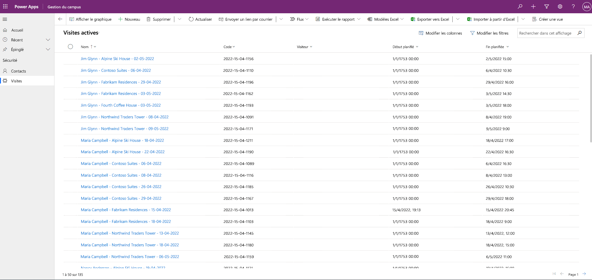

---
lab:
  title: "Labo 3\_: Comment créer une application pilotée par modèle"
  module: 'Module 3: Get started with Power Apps'
---

# Labo 3 : Comment créer une application pilotée par modèle

## Scénario

Bellows College is an educational organization with multiple buildings on campus. Campus visitors are currently recorded in paper journals. The information is not captured consistently, and there are no means to collect and analyze data about the visits across the entire campus.

L’administration du campus souhaite moderniser son système d’inscription des visiteurs où l’accès aux bâtiments est contrôlé par le personnel de sécurité et toutes les visites doivent être pré-enregistrées et enregistrées par leurs hôtes.

Tout au long de ce cours, vous créerez des applications et effectuerez une automatisation pour permettre au personnel administratif et de sécurité du Bellows College de gérer et de contrôler l’accès aux bâtiments du campus.

Dans ce labo, vous allez créer une application Power Apps pilotée par modèle pour permettre au personnel de bureau du campus de gérer les enregistrements de visites sur l’ensemble du campus.

Étapes de labo de haut niveau

Dans le cadre de la création de l’application basée sur un modèle, vous effectuerez les opérations suivantes :

- Créer une nouvelle application pilotée par modèle nommée Gestion du campus

- Modifier la navigation de l’application pour référencer les tables requises

- Personnaliser les formulaires et les vues des tables requises pour l’application

Nous travaillerons avec les composants suivants :

- **Vues** : Les vues permettent à l’utilisateur d’afficher les données existantes dans la table des formulaires.

- **Formulaires** : C’est là que l’utilisateur crée ou met à jour de nouvelles lignes dans les tables.

Les deux seront intégrés à l’application basée sur un modèle, pour une meilleure expérience utilisateur.

Prérequis

- Participation au **Module 0 - Labo 0 : Valider l’environnement de labo**
- Participation au **Module 2 Labo 1 : modélisation des données**

Éléments à considérer avant de commencer

- Quels changements devons-nous apporter pour améliorer l’expérience utilisateur ?
- Que devrions-nous inclure dans une application pilotée par modèle d’après le modèle de données que nous avons créé ?
- Quelles personnalisations peuvent être effectuées sur le plan du site d’une application pilotée par modèle ?

## Exercice 1 : personnaliser les affichages et les formulaires

**Objectif** : Au cours de cet exercice, vous apprendrez à personnaliser les vues et les formulaires des tables personnalisées qui seront utilisées dans l’application pilotée par modèle.

### Tâche \#1 : Modifier le formulaire de visite

1. Connectez-vous à [https://make.powerapps.com](https://make.powerapps.com/) si vous n’êtes pas encore connecté.

2. Sélectionnez votre environnement **Exercices pratiques [mes initiales]** en haut à droite, si ce n’est déjà fait.

3. Dans le volet de navigation de gauche, développez **Dataverse**, sélectionnez **Tables**, puis cliquez pour ouvrir votre table **Visite**.

Si vous ne voyez pas la table Visite, vérifiez que vous êtes dans l’environnement approprié (étape 2).

4. Sous la section **Expériences des données**, sélectionnez **Formulaires**, puis cliquez pour ouvrir le formulaire Informations de type **Principal**.

<bpt id="p1">**</bpt>IMPORTANT:<ept id="p1">**</ept> Since by default all forms are named Information, make sure to verify that the form you select has a Form Type of <bpt id="p2">**</bpt>Main<ept id="p2">**</ept> and not something else. By default, the form has two fields: Name and Owner.

5. À droite de l’écran dans le volet Propriétés, sélectionnez le champ **Nom complet**, puis remplacez-le par **Informations principales**.

6. Dans le menu en haut de l’écran, sélectionnez **+ Champ de formulaire** et ajoutez les champs suivants sous le champ **Propriétaire** en faisant glisser les colonnes dans le formulaire ou simplement en cliquant sur les noms des colonnes appropriées :

    1. **Visiteur**

    1. **Début prévu**

    1. **Fin prévue**

    1. **Début réel**

    1. **Fin réelle**

7. Faites glisser la colonne **Code** et déposez-la dans l’en-tête du formulaire.

The header is the top right area of the form. You may need to collapse the Properties panel on the right side of the screen to see the field on the form.

8. En gardant le champ **Code** sélectionné, cochez la case en regard de **Lecture seule** dans le panneau Propriétés à droite de l’écran.

9. Select <bpt id="p1">**</bpt>Owner<ept id="p1">**</ept> field. In the Properties panel, change the <bpt id="p1">**</bpt>Label<ept id="p1">**</ept> to <bpt id="p2">**</bpt>Host<ept id="p2">**</ept>

10. Cliquez sur **Enregistrer** en haut à droite et attendez la fin de l’enregistrement.

11. Cliquez sur **Publier** en haut à droite et attendez la fin de la publication.

12. Bellows College est une organisation éducative disposant de plusieurs bâtiments sur le campus.

13. Les visiteurs du campus sont actuellement enregistrés dans des journaux papier.

### Tâche \#2 : Modifier la vue Visites actives

Dans cette tâche, nous allons modifier la vue des visites actives par défaut et créer une nouvelle vue pour les visites du jour.

1. Dans la section **Expériences des données**, sélectionnez **Vues** et cliquez pour ouvrir votre vue **Visites actives**.

2. Ajoutez les champs suivants à la vue en cliquant sur ou en faisant glisser-déposer les champs :

    1. **Code**

    2. **Visiteur**

    3. **Début prévu**

    4. **Fin prévue**

3. Les informations ne sont pas saisies de manière cohérente et il n’y a aucun moyen de collecter ni d’analyser les données concernant les visites sur l’ensemble du campus.

4. Redimensionnez la largeur de chaque colonne pour faire rentrer les données.

5. Cliquez sur **Enregistrer** et attendez la fin de l’enregistrement.

6. Cliquez sur **Publier** et attendez la fin de la publication.

### Tâche n°3 : Créer une vue pour les visites du jour

Nous allons maintenant cloner la vue afin de créer une nouvelle vue pour les visites du jour.

IMPORTANT : Veillez à ne pas fermer la vue Visites actives, car nous allons l’exploiter pour créer la vue de visites du jour.

1. Cliquez sur la **flèche déroulante** affichée en regard du bouton Enregistrer (attention à ne pas appuyer sur le bouton lui-même) et sélectionnez **Enregistrer sous**.

2. Changez le nom en **Visites du jour** et appuyez sur **Enregistrer**.

3. Cliquez sur le lien **Modifier les filtres** dans le panneau Propriétés.

4. Cliquez sur **Ajouter**, puis sélectionnez **Ajouter une ligne**.

5. Sélectionnez le champ **Début programmé**, puis sélectionnez la condition **Aujourd’hui** dans la liste déroulante.

6. Click the <bpt id="p1">**</bpt>…<ept id="p1">**</ept> on the <bpt id="p1">**</bpt>Status<ept id="p1">**</ept> row and click <bpt id="p2">**</bpt>Delete<ept id="p2">**</ept> to delete that filter condition.

7. Press <bpt id="p1">**</bpt>Ok<ept id="p1">**</ept> to save the condition. The view is now filtered to show only records where the Scheduled Start date is today.

8. Ajoutez les champs **Début réel** et **Fin réelle** à la vue.

<bpt id="p1">**</bpt>Note:<ept id="p1">**</ept> Since we no longer filter on the view status, we will get all today’s visits including completed ones. These fields will help to differentiate completed visits and visits in progress.

1. Cliquez sur **Enregistrer**.

2. Cliquez sur **Publier** et attendez la fin de la publication.

## Exercice 2 : créer une application pilotée par modèle

**Objectif** : au cours de cet exercice, vous allez créer une application pilotée par modèle, personnaliser le plan du site et tester l’application.

Pour rester simples et faute de temps, nous n’aborderons pas certaines des colonnes de la table Visite dans ce labo.

### Tâche no 1 : créer une application

1. Connectez-vous à [https://make.powerapps.com](https://make.powerapps.com/) (si ce n’est déjà fait).

2. Sélectionnez votre environnement **Exercices pratiques [mes initiales]** en haut à droite, si ce n’est déjà fait.

3.  Si nécessaire, cliquez sur l’icône **Accueil** à gauche de l’écran.

3. Créer l’application pilotée par modèle :

    1. Sélectionnez **Application vide** dans la section **Démarrer à partir de** de l’écran d’accueil.

    1. Sous **Application vide basée sur Dataverse**, sélectionnez **Créer**.

    1. Entrez **Gestion du campus Bellows** comme nom et sélectionnez **Créer**.

4. Une fois votre nouvelle application pilotée par modèle chargée, sélectionnez le bouton **+ Ajouter une page**.

5. Dans l’écran Ajouter une page, choisissez **Vue et formulaire basés sur une table**, puis sélectionnez le bouton **Suivant**.

6. Ajoutez les tables suivantes :

    1. Accédez à

    1. Contact

7. Une fois que vous avez sélectionné les 2 tables, sélectionnez **Ajouter**.

8. À l’aide des icônes de navigation situées à gauche de l’écran, sélectionnez **Navigation**.

9. Dans le volet de navigation, sélectionnez le **Groupe 1** sous l’indication Barre de navigation.

10. À droite de l’écran, dans la section **Options d’affichage**, remplacez la propriété **Titre** par **Sécurité**.

### Tâche n° 2 : Modifier votre application

Tous les composants nécessaires étant désormais ajoutés à l’application pilotée par modèle, nous allons organiser les éléments.

1. Dans le volet de navigation, sous le groupe de sécurité, sélectionnez **SubArea1**.

2. Sélectionnez les **Points de suspension**. Dans le menu qui s’affiche, sélectionnez **Supprimer SubArea1**.

3. Dans le volet de navigation à gauche de l’écran, sélectionnez **Pages**.

4. Recherchez et développez **Visite** dans le volet Pages.

5. Sélectionnez **Formulaire de visite**.

6. Sur le côté droit de l’écran, sélectionnez **Ajouter un formulaire**.

7. Sélectionnez le formulaire **Informations principales**.

8. Sous **Visite** dans le volet Pages, sélectionnez **Vue des visites**.

9. Sur le côté droit de l’écran, sélectionnez **Ajouter une vue**.

10. Sélectionnez la vue **Visites du jour**.

11. Sélectionnez une nouvelle fois **Ajouter une vue**. 

12. Sélectionnez la vue **Visites actives**. 

13. Sélectionnez **Enregistrer**.

14. Une fois l’opération **Enregistrer** terminée, sélectionnez le bouton **Publier** pour publier vos modifications.

### Tâche n°3 : Application de test

1. Lancer l’application

    1. Sélectionnez **Lire** pour ouvrir votre application dans une nouvelle fenêtre.

2. Créer un nouveau contact

    1. The app should open to the <bpt id="p1">**</bpt>My Active Contacts<ept id="p1">**</ept> view. If it does not, select Contacts on the left-hand navigation.

    1. Cliquez sur **Nouveau** dans le menu supérieur.

    1. Indiquez John comme **Prénom** et Doe comme **Nom**.

    1. Provide your personal email as <bpt id="p1">**</bpt>Email<ept id="p1">**</ept>. This will be used in a future lab where you will receive an email.

    1. Cliquez sur **Enregistrer et fermer**.

    1. Vous devriez maintenant voir le contact créé dans la vue **Mes contacts actifs**.

3. Créer une nouvelle visite

    1. Sélectionnez **Visites** à partir de la navigation de gauche du plan du site.

    1. Cliquez sur **+ Nouveau**.

    1. Si nécessaire, remplissez les champs.

        1. **Nom** : Nouvelle visite test

        1. **Visiteur** : sélectionnez John Doe.

        1. **Début planifié** : sélectionnez la date de demain et 14h00 comme heure de début.

        1. **Fin planifiée** : sélectionnez la date de demain et 15h30 comme heure de fin.

- Click <bpt id="p1">**</bpt>Save &amp; Close<ept id="p1">**</ept>. This will create the Visit and you should be able to see it on the Active Visits View.

- Change view to <bpt id="p1">**</bpt>Today’s Visits<ept id="p1">**</ept>. You should no longer see the new visit in the view, since it is scheduled for tomorrow.

4. Vous pouvez ajouter d’autres enregistrements test.

Votre application en cours d’exécution doit ressembler à ceci :

Congratulations! You have created and configured your first model-driven app.

## Défis

- Sélectionner des vues et des formulaires spécifiques pour les contacts