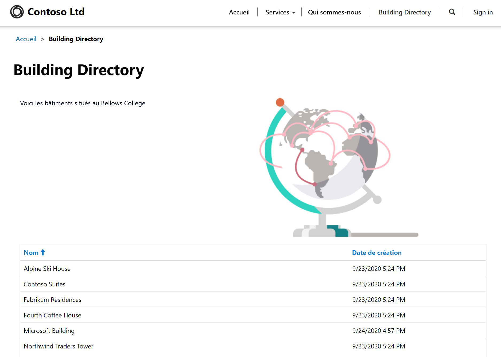

---
lab:
    title: 'Labo 5 : Comment développer un portail Power Apps'
    module: 'Module 3 : Premiers pas avec Power Apps'
---

# Module 3 : Premiers pas avec Power Apps

## Labo 4 : Comment développer un portail Power Apps

# Scénario

Bellows College est une organisation éducative disposant de plusieurs bâtiments sur le campus. Les visites sur le campus sont actuellement enregistrées dans des journaux papier. Les informations ne sont pas saisies de manière cohérente et il n’y a aucun moyen de collecter ni d’analyser les données concernant les visites sur l’ensemble du campus.

L’administration du campus souhaite fournir aux visiteurs des informations sur les bâtiments du campus. Les visiteurs pourront voir la liste des bâtiments sur un site web, construit à l’aide d’un portail Power Apps.

Dans ce labo, vous allez configurer un portail Power Apps et créer une page web de portails qui affichera une liste des bâtiments du campus.

# Étapes de labo de haut niveau

Vous suivrez le plan ci-dessous pour concevoir le portail Power Apps :

* Configurer un portail Power Apps dans l’environnement Dataverse
* Créer et configurer une page web pour afficher une liste des bâtiments
* Créer un nouveau thème et l’appliquer au portail

## Prérequis

* Achèvement du **Module 0 - Labo 0 : Valider l’environnement de labo**
* Achèvement du **Module 2 - Labo 1 : Présentation de Microsoft Dataverse**

## Éléments à considérer avant de commencer

* Les applications Portails Power Apps sont toujours lancées à partir d’un modèle et non d’une application vide. Votre portail doit avoir été créé dans le labo 0 du module 0. Une fois que vous avez configuré un portail, il est déjà doté de pages, de menus et d’un thème par défaut. 

# Exercice \#1 : Créez une page web de portail

**Objectif :** Au cours de cet exercice, vous apprendrez à créer une nouvelle page web qui affichera du contenu statique, ainsi qu’une liste des bâtiments de Dataverse.

## Tâche \#1 : Accéder au portail

1.  Accédez à <https://make.powerapps.com>.

2.  Vérifiez que vous vous trouvez bien dans votre environnement Exercices pratiques. Si ce n’est pas le cas, modifiez l’environnement dans la partie supérieure droite.

3.  Cliquez sur **Application**.

4.  Localisez l’application qui possède le **Type** **Portail**.

5.  Cliquez sur le nom de l’application pour ouvrir le portail.

    > Vous serez ensuite redirigé sur la page d’arrivée du site web de votre portail, avec un message de bienvenue. Parcourez votre portail afin d’identifier les éléments créés par défaut lorsque vous l’avez configuré. 

## Tâche \#2 : Créer une page web

1.  Ouvrez Portails Power Apps Studio.

    -   Connectez-vous à <https://make.powerapps.com> (peut rester constamment ouvert dans vos onglets).

    -   Sélectionnez **Applications**.
    
    -   Localisez l’application qui possède le **Type** **Portail**.

    -   Cliquez sur les points de suspension (**...**) à droite du nom de l’application des portails et choisissez **Modifier**.

    > Vous êtes maintenant dans le studio Portails Power Apps. C’est ici que vous pouvez modifier et créer le contenu du portail.

2.  Créer une nouvelle page

    -   Dans la barre de commandes, sélectionnez **Nouvelle page**.

    - Sélectionnez **Page d’arrivée**

3.  Dans le panneau Propriétés, sous **Afficher**, remplacez le **Nom** **Nouvelle page (1)** par `Building Directory`.

4.  Dans l’**URL partielle**, remplacez la valeur existante par `building-directory`, appuyez sur la touche Tab (pour lancer l’enregistrement automatique).

    > Le titre de la page doit maintenant indiquer **Répertoire du bâtiment**.
    
## Tâche \#3 : Ajouter du contenu statique

1.  Ajouter une section à la page web

    - Sur le canevas (zone affichant la page web), sélectionnez une section de la page autre qu’une colonne.

    -   Sur la ceinture porte-outils (côté gauche), sélectionnez l’icône **Composants**.

    -   Choisissez **Section deux colonnes** dans la zone **Disposition de la section**.

2.  Ajouter du texte statique

    -   Sur le canevas (zone affichant la page web), sélectionnez la colonne de gauche.

    -   Sur la ceinture porte-outils (côté gauche), sélectionnez l’icône **Composants**.

    -   Choisissez **Texte** dans la zone **Composants du portail**.

    -   Dans la nouvelle zone de texte, saisissez le texte suivant :
          ```
          The following is the building directory.
          ```
    -   Sélectionnez la zone de texte au-dessus de celle que vous venez de modifier, puis cliquez sur **Supprimer** dans la barre de commandes pour supprimer le texte par défaut.

3. Ajouter une image

    -   Sur le canevas (zone affichant la page web), sélectionnez la colonne de droite.

    -   Sur la ceinture porte-outils (côté gauche), sélectionnez l’icône **Composants**.

    -   Choisissez **Image** dans la zone **Composants du portail**.

    - Dans le volet des propriétés, cliquez sur **Sélectionnez une image**. Localisez et sélectionnez **Pages.png**
    
    -   Dans le volet des propriétés, cliquez sur la liste déroulante de la section **Mise en forme** et remplacez la valeur de la zone **Largeur** par 70 % (assurez-vous de saisir le %). Vous pouvez jouer avec la taille de l’image jusqu’à ce qu’elle soit comme vous le souhaitez.

4.  Configurez les droits d’affichage de la liste des bâtiments 

    -   Dans le menu de gauche, cliquez sur Paramètres (Icône représentant un engrenage) et choisissez **Afficher plus de paramètres**. Un nouvel onglet s’ouvre, présentant des paramètres supplémentaires.

    -   Faites défiler le menu de gauche jusque **Sécurité** et sélectionnez **Autorisations de table**.

    -   Cliquez sur **Nouveau** et ajoutez les valeurs suivantes :

        -   **Nom** : Affiche la liste des bâtiments.
        -   **Nom de la table** : Dans la liste déroulante du volet droit, sélectionnez Building (bc_building)
        -   **Site web** : Cliquez sur la loupe et sélectionnez votre site web (visiteurs de Bellows College – [your naming])
        -   **Type d’accès** : Mondial
        -   **Privilèges** : Lecture
    
    -   Dans le menu supérieur, sélectionnez **Enregistrer**.
    
    -   Descendez jusqu’à la section **Rôles web** et sélectionnez **Ajouter un rôle web existant**.
    
    -   Cliquez sur la loupe, sélectionnez **Utilisateurs anonymes**, puis cliquez sur **Ajouter**.
    
    -   Dans le menu supérieur, sélectionnez **Enregistrer & Fermer**.
    
    -   Revenez au niveau de l’onglet précédent.

5.  Cliquez sur **Parcourir le site web** pour afficher la page jusqu’à présent.  Notez la présence de l’option **Répertoire des bâtiments** dans le menu principal.

    > Vous devrez peut-être configurer votre navigateur pour autoriser les fenêtres contextuelles.

## Tâche \#4 : Ajouter un composant de liste

1.  Accédez à l’onglet précédent et passez à l’étape n° 2. S’il n’est pas disponible, procédez comme suit pour revenir à cet emplacement.

    -   Connectez-vous à <https://make.powerapps.com> (peut rester constamment ouvert dans vos onglets)

    -   Localisez l’application qui possède le **Type** **Portail**.

    -   Cliquez sur les points de suspension (**...**) et choisissez **Éditer**.
    
    -   Dans la ceinture porte-outils (côté gauche), choisissez l’option **Pages**. 

    -   Localisez et sélectionnez la page **Répertoire du bâtiment** que vous avez créée précédemment.
    
2.  Ajoutez un composant de liste à la page Répertoire des bâtiments.

    -   Sélectionnez la section dotée de deux colonnes.

    -   Sur la ceinture porte-outils (côté gauche), sélectionnez l’icône **Composants**.

    -   Choisissez **Section une colonne** dans la zone **Disposition de la section** (une section apparaîtra sous l’image et le texte sur la page web).

    -   Sélectionnez la nouvelle section de colonne sur le canevas.

    -   Sur la ceinture porte-outils (côté gauche), sélectionnez l’icône **Composants**.

    -   Choisissez **Liste** dans la zone des **Composants du portail** (un composant de liste apparaîtra dans la nouvelle section).
    
3.  Configurer le composant de liste

    -   Sélectionnez le composant de liste sur le canevas.

    -   Dans le volet droit du panneau Propriétés, saisissez `Buildings List` dans le champ **Nom**.

    -   Dans le champ **Table**, sélectionnez **Bâtiment (bc_building)** dans la liste déroulante.

    -   Dans les **Vues**, choisissez **Bâtiments actifs**.

    -   Laissez les paramètres par défaut restants.
    
4.  Cliquez sur **Parcourir le site web** pour afficher la page. 

    > Vous devez voir la liste des Bâtiments de votre base de données Dataverse apparaître sur la page web.

# Exercice \#2 : Modifier le thème du portail

**Objectif :** Dans cet exercice, vous allez créer un nouveau thème qui modifiera le modèle de couleurs de votre portail. 

## Tâche n° 1 : Appliquer et modifier un thème

1.  Accédez à l’onglet précédent et passez à l’étape n° 2. S’il n’est pas disponible, procédez comme suit pour revenir à cet emplacement.

    -   Connectez-vous à <https://make.powerapps.com> (peut rester constamment ouvert dans vos onglets).

    -   Localisez l’application qui possède le **Type** **Portail**.

    -   Cliquez sur les points de suspension (**...**) et choisissez **Éditer**.
    
2.  Appliquer et personnaliser un thème de base

    -   Sur la ceinture porte-outils (volet gauche), sélectionnez l’icône **Thèmes**.
    
    - Faites basculer **Activer le thème de base** sur Activé.
    
    -   Sur l’un des préréglages, cliquez sur les points de suspension (**...**) et choisissez **Personnaliser**.
    
    -   Une copie du thème de base a été créée. 
    
    -   Dans le volet des propriétés, jouez avec la modification des couleurs et découvrez l’impact de ces modifications sur votre portail.
    
    -   Renommez votre thème.
    
3.  Dans la barre de commandes, cliquez sur **Configuration de la synchronisation**.

La disposition de votre application doit ressembler à la structure suivante :



# Défis

* Créez une vue Bâtiments différente, qui affiche uniquement le nom du bâtiment. Sélectionnez **Parcourir le site web** dans le studio Portal pour voir les modifications.
* Sur la ceinture porte-outils, cliquez sur l’icône **Thèmes** et modifiez le CSS de votre thème personnalisé.
* Créez une page avec le composant **Formulaire** et modifiez un composant **Liste** pour ajouter ou modifier des lignes Dataverse avec le formulaire.
* Si vous activez **Autorisations d’entité** dans les **Réglages** d’un composant **Liste**, qu’arrive-t-il aux données ?
* Dans le studio Portail, sélectionnez l’icône Éditeur de code source `</>` pour afficher la source de la page. Si vous êtes familiarisé avec HTML, apportez quelques modifications et affichez les résultats.
