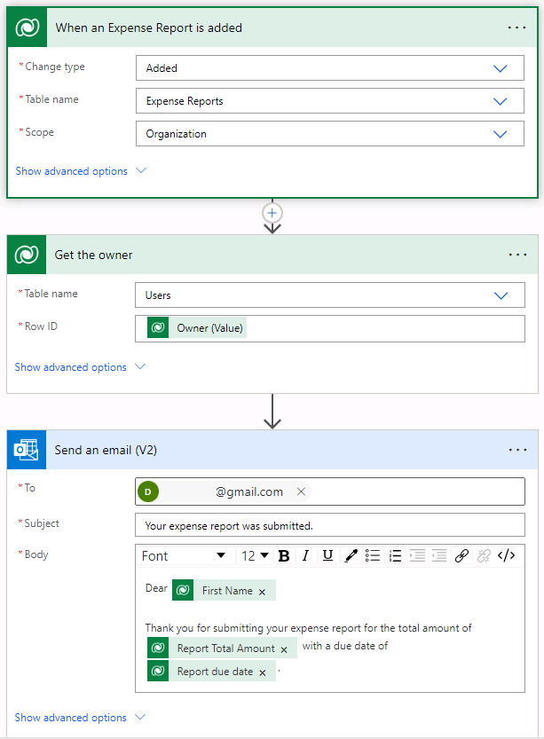

---
lab:
  title: "Labo\_4\_: Création d’une solution automatisée"
  module: 'Module 4: Describe building automation with Microsoft Power Automate'
---

# Labo 4 : Création d’une solution automatisée

**Locataires WWL - Conditions d’utilisation** Si un locataire est fourni dans le cadre d’une formation dispensée par un instructeur, notez qu’il est mis à votre disposition dans le seul but de prendre en charge les labos pratiques de la formation. Vous ne devez ni partager ni utiliser les locataires en dehors des labos pratiques. Le locataire utilisé dans ce cours est un locataire d’essai qui ne peut pas être utilisé ni être accessible une fois la classe terminée, ni faire l’objet d’une prolongation. Vous n’êtes pas autorisé à convertir un locataire en abonnement payant. Les locataires obtenus dans le cadre de ce cours sont la propriété de Microsoft Corporation. Nous nous réservons le droit d’y accéder et d’en reprendre possession à tout moment. 

## Scénario

Bellows College est un établissement d’enseignement avec plusieurs campus et plusieurs cursus. De nombreux enseignants et administrateurs de Bellow College doivent assister à des événements et acheter des articles. Le suivi de ces dépenses a toujours été un défi en soi. 

L’administration des campus aimerait moderniser son système de notes de frais en fournissant aux employés un moyen numérique de soumettre leurs dépenses. 

Tout au long de ce cours, vous allez générer des applications et effectuer une automatisation pour permettre aux employés de Bellows College de gérer les frais. 

Dans ce labo, vous allez créer un flux Power Automate pour envoyer par e-mail une copie de la note de frais à utiliser lorsqu’ils vont en créer une.

## Étapes de labo de haut niveau

Les éléments suivants ont été identifiés comme des exigences que vous devez implémenter pour terminer le projet :

- Les employés doivent recevoir un e-mail lors de l’envoi d’une note de frais. 

### Prérequis

- Participation au **Module 1 Labo 0 – Valider l’environnement de labo**

## Exercice 1 : Créer un flux de notification des notes de frais

**Objectif** : Dans cet exercice, vous allez créer un flux Power Automate qui met en place ces conditions. 

### Tâche n°1 : Créer un flux

1. Accédez à https://make.powerapps.com.

1. Vous devrez peut-être vous réauthentifier. Sélectionnez **Se connecter** et suivez les instructions si nécessaire.

1. Sélectionnez l’environnement **Dev One** en haut à droite, si ce n’est pas déjà fait.

1. Dans le volet de navigation de gauche, sélectionnez **Flux**.

1. Si vous y êtes invité, sélectionnez **Démarrage**.

1. Sélectionnez **+ Nouveau flux**, puis sélectionnez **Flux cloud automatisé**.

1. Entrez Notification de frais dans **Nom du flux**.

1. Sous **Choisir le déclencheur de votre flux**, recherchez Dataverse.

1. Choisissez le déclencheur **Quand une ligne est ajoutée, modifiée ou supprimée**, puis sélectionnez **Créer**.

1. Remplissez les conditions du déclencheur pour le flux :

    1. Sélectionner **Ajouté** pour **Type de modification**
    
    1. Sélectionnez **Notes de frais** pour le **Nom de table**.

    1. Sélectionnez **Organisation** dans la liste **Étendue**.

    1. À l’étape du déclencheur, sélectionnez les points de suspension ( **...** ), puis **Renommer**. Renommer l’étape de déclencheur `When an Expense Report is added` 

Il s’agit d’une bonne pratique, qui vous permet, ainsi que d’autres éditeurs de flux, de comprendre le but de l’étape sans devoir vous plonger dans les détails.

### Tâche n° 2 : Créer une étape pour obtenir une ligne de note de frais

1. Sélectionnez **+ Nouvelle étape**. Cette étape récupère les informations de la note de frais, y compris l’adresse e-mail.

1. Rechercher Dataverse

1. Sélectionnez l’action **Obtenir une ligne par ID**.

1. Sélectionnez **Utilisateurs** comme **Nom de table**.

1. Sélectionnez le champ **ID de ligne** . Notez qu’une fenêtre s’ouvre pour vous permettre de sélectionner **Contenu dynamique** ou **Expressions**.

1. Dans le champ **ID de ligne**, sélectionnez **Propriétaire (valeur)** dans la liste **Contenu dynamique**. Dans cette étape, vous recherchez le Propriétaire pour la ligne de note de frais créée afin de déclencher ce flux. 

1. Dans l’action **Obtenir une ligne par ID**, sélectionnez les points de suspension ( **...** ), puis **Renommer**. Renommez cette action Obtenir le propriétaire.

Il s’agit d’une bonne pratique, qui vous permet, ainsi que d’autres éditeurs de flux, de comprendre le but de l’étape sans devoir vous plonger dans les détails.

### Tâche n°3 : créer une étape pour envoyer un e-mail afin de confirmer l’envoi d’une note de frais

1. Sélectionnez **+ Nouvelle étape**. Au cours de cette étape, un e-mail est envoyé à la personne qui a soumis une note de frais.

1. Recherchez l’e-mail, sélectionnez l’action **Envoyer un e-mail (V2)** dans le connecteur **Office 365 Outlook**.

1. Si vous êtes invité à accepter les conditions d’utilisation pour cette action, sélectionnez **Accepter**.

1. Sélectionnez le champ **À**, puis entrez votre adresse e-mail personnelle. (Il existe différentes façons de remplir dynamiquement une adresse e-mail, mais nous allons l’attribuer manuellement pour cet exercice.)  

1. Dans le champ **Objet**, entrez Votre note de frais a été soumise

1. Entrez le texte suivant dans le **Corps du courriel**.

Le contenu dynamique doit être placé là où les champs sont nommés entre crochets. Il est recommandé de commencer par copier et coller l’ensemble du texte, puis d’ajouter du contenu dynamique aux endroits appropriés.

    Dear {First Name},
    
    Thank you for submitting your expense report for the total amount of {Report Total Amount} with a due date of {Report Due Date}.
    
     
    Best regards,
    Campus Administration
    Bellows College

1. Mettez en surbrillance le texte **{First Name}** . Remplacez-le par le champ **Prénom** de l’étape **Obtenir le propriétaire**.

1. Mettez en surbrillance le texte **{Report Total Amount}**. Remplacez-le par le champ **Montant total de la note** de l’étape **Lorsqu’une note de frais est envoyée**.

1. Mettez en surbrillance le texte **{Report Due Date}**. Remplacez-le par le champ **Date d’échéance de la note** de l’étape **Lorsqu’une note de frais est envoyée**.

1. Sélectionnez **Enregistrer**.

Laissez cet onglet de flux ouvert pour la tâche suivante. Votre flux doit ressembler à ceci :

### Tâche 4 : Valider et tester le flux

1. Ouvrez un nouvel onglet dans votre navigateur, puis accédez à https://make.powerapps.com

1. Sélectionnez l’environnement **Dev One** en haut à droite, si ce n’est pas déjà fait.

1. Sélectionnez **Applications** et ouvrez **Application de suivi des frais**.

1. En laissant cet onglet de navigateur ouvert, revenez à l’onglet précédent avec votre flux.

1. Dans la barre de commandes, sélectionnez **Tester**. Sélectionnez **Manuellement**, puis **Tester**.

1. Accédez à l’onglet du navigateur en ayant votre application pilotée par modèle ouverte.

1. Dans la navigation du plan du site à gauche, sélectionnez **Note de frais**.

1. Sélectionnez le bouton **+ Nouveau** pour ajouter un nouvel enregistrement **Note de frais**.

1. Terminez l’**enregistrement Note de frais** comme suit :

    - **Nom de note :** Impression test

    - **Date d’échéance de la note :** Demain 

1. Cliquez sur le bouton **Enregistrer et fermer**.

1. Accédez à l’onglet du navigateur où votre test de flux est en cours d’exécution. Après un court délai, vous devez voir le flux en cours d’exécution. C'est là que vous pouvez détecter tout problème dans le flux ou confirmer qu’il s'est bien déroulé.

Après un court instant, vous devriez voir un e-mail dans votre boîte de réception. 

>**Remarque :** Cet e-mail peut se retrouver dans votre dossier Courrier indésirable.
