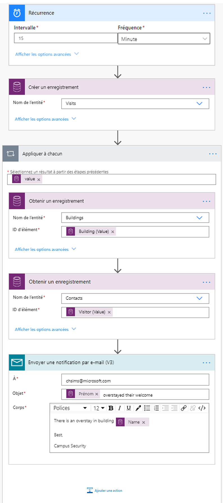

---
lab:
    title: 'Labo 6 : Comment créer une solution automatisée'
    module: 'Module 4 : Prise en main de Power Automate'
---

# Module 4 : Prise en main de Power Automate
## Labo : Création d’une solution automatisée

## Scénario

Bellows College est une organisation éducative disposant de plusieurs bâtiments sur le campus. Les visiteurs du campus sont actuellement enregistrés dans des journaux papier. Les informations ne sont pas saisies de manière cohérente et il n’y a aucun moyen de collecter ni d’analyser les données concernant les visites sur l’ensemble du campus. 

L’administration du campus souhaite moderniser son système d’inscription des visiteurs où l’accès aux bâtiments est contrôlé par le personnel de sécurité et toutes les visites doivent être pré-enregistrées et enregistrées par leurs hôtes.

Tout au long de ce cours, vous créerez des applications et effectuerez une automatisation pour permettre au personnel administratif et de sécurité du Bellows College de gérer et de contrôler l’accès aux bâtiments du campus. 

Au cours de ce labo, vous allez créer des flux Power Automate pour automatiser différents aspects de la gestion du campus. 

# Étapes de labo de haut niveau

Les éléments suivants ont été identifiés comme des exigences que vous devez implémenter pour terminer le projet :

* Le code unique attribué à chaque visiteur doit être mis à sa disposition avant sa visite.
* Le personnel de sécurité doit recevoir des notifications des visiteurs dépassant leur plage horaire programmée.

## Prérequis

* Achèvement du **Module 0 - Labo 0 : Valider l’environnement de labo**
* Achèvement du **Module 2 - Labo 1 : Présentation de Microsoft Dataverse**
* Application Campus Staff créée dans le **Module 3 - Labo 2 : Comment créer une application canevas, partie 2** (à des fins de test)
* Contact John Doe créé avec une adresse e-mail personnelle dans le **Module 3 - Labo 4 : Comment créer une application pilotée par modèle** (à des fins de test)

## Éléments à considérer avant de commencer

-   Quel est le mécanisme de distribution le plus approprié pour les codes des visiteurs ?
-   Comment mesurer les dépassements de plage horaire et appliquer des politiques strictes ?

# Exercice \#1 : Créer un flux de notification de visite

**Objectif :** Dans cet exercice, vous allez créer un flux Power Automate qui met en place ces conditions. Le visiteur doit recevoir un e-mail contenant le code unique attribué à la visite.

## Tâche \#1 : Créer un flux

1.  Ouvrez votre solution Gestion du campus.

    -   Connectez-vous à <https://make.powerapps.com>

    -   Sélectionnez votre **environnement**.

    -   Sélectionnez **Solutions**.

    -   Cliquez pour ouvrir votre solution de **Gestion du campus**.

2.  Cliquez sur **Nouveau** et sélectionnez **Automatisation**, **Flux de cloud**, puis **Automatisé**. Cela ouvrira l’éditeur de flux de Power Automate dans une nouvelle fenêtre.

3. Dans la section **Choisissez un déclencheur de flux**, recherchez **Microsoft Dataverse**.

4. Sélectionnez le déclencheur **Lorsqu’une ligne est ajoutée, modifiée ou supprimée**, puis cliquez sur **Créer**.

   * Sélectionnez **Ajoutée** dans la section **Type de changement**
   
   * Sélectionnez **Visites** dans la zone **Nom de table**.
   
   * Sélectionnez **Organisation** dans la liste **Étendue**.
   
   * À l’étape de déclenchement, cliquez sur les points de suspension (**...**), puis sur **Renommer**. Renommez ce déclencheur **« Lors de l’ajout d'une visite »**. Il s’agit d’une bonne pratique, qui vous permet, ainsi qu’autres éditeurs de flux, de comprendre le but de l’étape sans vous plonger dans les détails.

5. Sélectionnez **Nouvelle étape**. Cette étape est nécessaire pour récupérer les informations des visiteurs, y compris les adresses e-mail.

6. Recherchez **Microsoft Dataverse**.

7. Sélectionnez l’action **Obtenir une ligne par identifiant**. 

   * Sélectionnez **Contacts** comme **Nom de table**
   
   * Dans le champ **Identifiant de ligne**, sélectionnez **Visiteur (valeur)** dans la liste de contenu dynamique.
   
   * Dans cette action, cliquez sur les points de suspension (**...**), puis sur **Renommer**. Renommez cette action **« Obtenir le visiteur »**. Il s’agit d’une bonne pratique, qui vous permet, ainsi qu’autres éditeurs de flux, de comprendre le but de l’étape sans vous plonger dans les détails.

8. Cliquez sur **Nouvelle étape**. Il s’agit de l’étape qui permettra de créer et d’envoyer des e-mails au visiteur.

9. Recherchez *e-mail*, sélectionnez le connecteur **Outlook Office 365**, puis l’action **Envoyer un e-mail (V2)**.

   * Si vous êtes invité à accepter les conditions d’utilisation de cette action, cliquez sur **J’accepte**.
   
   * Sélectionnez le champ **À** et sélectionnez **courriel** dans le volet de contenu dynamique. Ils sont accessibles sous l’en-tête **Recevoir le visiteur**. Cela signifie que vous sélectionnez l’e-mail associé au visiteur que vous avez recherché à l’étape précédente. 

   * Entrez **Votre visite prévue à Bellows College** dans le champ **Sujet**.

   * Entrez le texte suivant dans le **Corps du courriel**.  
        
        > Le contenu dynamique doit être placé là où les champs sont nommés entre crochets. Il est recommandé de commencer par copier et coller l’ensemble du texte, puis d’ajouter du contenu dynamique aux endroits appropriés.
   
        ```
        Dear {First Name},

        You are currently scheduled to visit Bellows Campus from {Scheduled Start} until {Scheduled End}.

        Your security code is {Code}, please do not share it. You will be required to produce this code during your visit.

        Best regards,

        Campus Administration
        Bellows College
        ```
   
10.  Sélectionnez le nom du flux **Sans titre** en haut et renommez-le `Visit notification`.

11. Appuyez sur **Enregistrer**

    Laissez cet onglet de flux ouvert pour la tâche suivante. Votre flux doit ressembler à ce qui suit :


## Tâche \#2 : Valider et tester le flux

1.  Ouvrez un nouvel onglet dans votre navigateur et accédez à <https://make.powerapps.com>.

2.  Cliquez sur **Applications** et sélectionnez l’application **Personnel du campus** que vous avez créée.

3.  En laissant cet onglet ouvert, revenez à l’onglet précédent avec votre flux. 

4.  Dans la barre de commandes, cliquez sur **Test**. Sélectionnez **Manuel**, puis **Enregistrer et tester**.

5.  En laissant l’onglet de flux ouvert, revenez à l’onglet précédent avec l’application **Personnel du campus**.

6.  Appuyez sur **+** pour ajouter un nouvel enregistrement de visite.

7.  Entrez **John Doe** comme **Nom** et choisissez n’importe quel **Bâtiment**.

8.  Choisissez **John Doe** comme le **Visiteur**.

9.  Définissez la **Date de début prévue** et la **Date de fin prévue** à des dates ultérieures.

10.  Sélectionnez l’icône représentant une **coche** pour enregistrer la nouvelle visite

11.  Revenez à l’onglet précédent avec le flux testé. Examinez l’exécution du flux. S’il y a des erreurs, revenez en arrière et comparez votre flux à l’exemple ci-dessus. Si l’e-mail est envoyé avec succès, vous le recevrez dans votre boîte de réception. 

12.  Dans la barre de commandes, cliquez sur la flèche Précédent.

13.  Dans la section **Détails**, remarquez que le **Statut** est défini sur **Activé**. Cela signifie que votre flux s’exécutera lors de la création de chaque nouvelle visite, jusqu’à ce que vous la désactiviez. Chaque fois que le flux s’exécute, vous le verrez ajouté à la liste de l’**Historique des exécutions de 28 jours**.

14.  Désactivez le flux en cliquant sur **Désactiver** dans la barre de commandes. Vous devrez peut-être appuyer sur les points de suspension (**...**) pour voir cette option.

15.  Fermez cette fenêtre.

# Exercice n° 2 : Créer un flux de balayage de sécurité

**Objectif :** Dans cet exercice, vous allez créer un flux Power Automate qui met en place ces conditions. Un balayage de sécurité doit être effectué toutes les 15 minutes et la sécurité doit être avertie si l’un des visiteurs a dépassé le temps prévu.

## Tâche n° 1 : Créer un flux pour récupérer des enregistrements

1. Ouvrez votre solution Gestion du campus.

   -   Connectez-vous à <https://make.powerapps.com>

   -   Sélectionnez votre **Environnement**.

   -   Sélectionnez **Solutions**.

   -   Cliquez pour ouvrir votre solution de **Gestion du campus**.

2. Cliquez sur **Nouveau** et sélectionnez **Automatisation**, **Flux de cloud**, puis **Planifié**. Cela ouvrira l’éditeur de flux de Power Automate dans une nouvelle fenêtre.

3. Définissez une répétition du flux toutes les **15** minutes.

4. Cliquez sur **Créer**.

5. Cliquez sur **Nouvelle étape**. Recherchez *En cours*, puis sélectionnez le connecteur **Microsoft Dataverse**. Sélectionnez l’action **Répertorier les lignes**.

   * Saisissez **Visites** comme **Nom de table**.
   
   * Cliquez sur **Afficher les options avancées**.

   * Saisissez l’expression suivante comme **Filtre de lignes**.

   ```
     statecode eq 0 and bc_actualstart ne null and bc_actualend eq null and Microsoft.Dynamics.CRM.OlderThanXMinutes(PropertyName='bc_scheduledend',PropertyValue=15)
   ```
   
   * Pour la décomposer :
       * **statecode eq 0** filtre les visites actives (où le Statut est égal à Actif).
       * **bc_actualstart ne null** restreint la recherche aux visites où l’option Début réel contient une valeur, c’est-à-dire que quelqu’un est effectivement arrivé.
       * **bc_actualend eq null** limite la recherche aux visites où il n’y a pas eu de départ (le champ Fin réelle n’est pas renseigné). 
       * **Microsoft.Dynamics.CRM.OlderThanXMinutes(PropertyName='bc_scheduledend',PropertyValue=15)** restreint les visites à celles qui devaient se terminer il y a plus de 15 minutes.

   * Dans cette action, cliquez sur les points de suspension (**...**), puis sur **Renommer**. Renommez cette action **« Répertorier les visites actives qui se sont terminées il y a plus de 15 minutes »**. Il s’agit d’une bonne pratique, qui vous permet, ainsi qu’autres éditeurs de flux, de comprendre le but de l’étape sans vous plonger dans les détails.

6.  Cliquez sur **Nouvelle étape**. Recherchez *Appliquer*, sélectionnez l’action **Appliquer à chacun**. 

7.  Sélectionnez une **valeur** à partir du contenu dynamique dans le champ **Sélectionnez un résultat à partir des étapes précédentes**. Ce champ est situé en dessous de l’en-tête grisée **Répertoriez les visites actives qui se sont terminées il y a plus de 15 minutes**. Cela signifie que vous sélectionnez la liste des visites que vous avez recherchées à l’étape précédente. 

8.  Accédez aux données du bâtiment pour l’enregistrement associé.

    * Cliquez sur **Ajouter une action** dans Appliquer à chaque boucle.
    
    * Sélectionnez **Microsoft Dataverse**. 
    
    * Sélectionnez l’action **Obtenir une ligne par identifiant**.
    
    * Sélectionnez **Bâtiments** comme **Nom de table**.
    
    * Sélectionnez **Bâtiment (Valeur)** comme **Identifiant de ligne** à partir du contenu dynamique.
    
    * Cliquez sur **[...]** en regard du champ **Obtenir un enregistrement**, puis sélectionnez **Renommer**. Saisissez **Obtenir un bâtiment** comme nom d’étape.
    
9.  Récupérez les données des visiteurs pour l’enregistrement associé.

    * Cliquez sur **Ajouter une action** dans Appliquer à chaque boucle.
    
    * Sélectionnez **Microsoft Dataverse**.
    
    * Sélectionnez l’action **Obtenir une ligne par identifiant**.
    
    * Sélectionnez **Contacts** comme **Nom de table**.
    
    * Sélectionnez **Visiteur (Valeur)** comme **Identifiant de ligne** à partir du contenu dynamique
    
    * Cliquez sur **[...]** en regard du champ **Obtenir un enregistrement**, puis sélectionnez **Renommer**. Saisissez **Obtenir un visiteur** comme nom d’étape.
    
10.  Envoyer une notification par courrier

     * Cliquez sur **Ajouter une action** dans Appliquer à chaque boucle. Ajoutez l’action **Envoyer un e-mail (V2)** depuis la connexion **Outlook Office 365**.

11.  Tapez votre adresse e-mail dans le champ **À**.

12.  Saisissez ce qui suit dans le champ **Sujet**. **Nom complet** est un contenu dynamique de l’étape **Recevoir un visiteur**.

   ```
   {Full Name} overstayed their welcome
   ```
   
13.  Saisissez ce qui suit dans le champ **Corps**. **Nom** est un contenu dynamique de l’étape **Obtenir un bâtiment**. Vous devrez peut-être faire défiler la liste jusqu’en bas.

   ```
   There is an overstay in building {Name}.
         
   Best,
         
   Campus Security
   ```

14.  Sélectionnez le nom du flux **Sans titre** dans le coin supérieur gauche et renommez-le **Balayage de sécurité**.

15.  Appuyez sur **Enregistrer**

    Votre flux doit ressembler à ceci :



## Tâche n° 2 : Valider et tester le flux

Votre flux commencera à vous envoyer des e-mails (à l’adresse e-mail que vous avez précédemment spécifiée lors de la création du contact John Doe), s’il y a des visites qui répondent aux conditions énoncées dans le flux.

1. Confirmez que vous avez des enregistrements de visites qui :

   1. Ont un statut actif
   
   2. L’heure de fin programmée est passée (de plus de 15 minutes).
   
   3. Le champ Début réel est renseigné.
   
   > **Remarque** : Pour afficher ces données, accédez à make.powerapps.com dans un nouvel onglet. Cliquez sur Solutions dans le volet gauche pour localiser votre solution. Sélectionnez l’entité Visite, puis l’onglet Données. Cliquez sur Visites actives dans le coin supérieur droit pour afficher le sélecteur de vue, puis sélectionnez Tous les champs.
   
2. Rendez-vous sur votre flux de **Balayage de sécurité**, si ce n’est pas déjà le cas.

3. Lorsque votre flux s’ouvre, cliquez sur **Tester**.

4. Sélectionnez **Manuel**.

5. Cliquez sur **Enregistrer et tester** et **Exécuter le flux**.

6. Lorsque le flux est en concurrence, cliquez sur **Terminé**. 

7. Lorsque le flux entre en concurrence, développez **Appliquer à chacun**, puis développez l’étape **Envoyer une notification par e-mail**. Vérifiez les valeurs **Sujet** et **Corps du message électronique**.

8. Sélectionnez la flèche Précédent pour obtenir des informations sur le flux de balayage de sécurité. Sélectionnez **Désactiver** dans la barre de commandes. Cela permet d’empêcher l’exécution du flux selon une planification du système de test.

# Défis

* Ajoutez le Début réel et la Fin prévue au corps de l’e-mail.
* Comment pouvez-vous garantir une mise en forme conviviale des dates dans le corps du message ?
* Est-il possible de générer un tableau avec les informations des visites qui ont duré trop longtemps et d’envoyer un seul e-mail ?
* Pouvez-vous générer un code-barres pour le code de visite ? Quand cela sera-t-il utile ?
