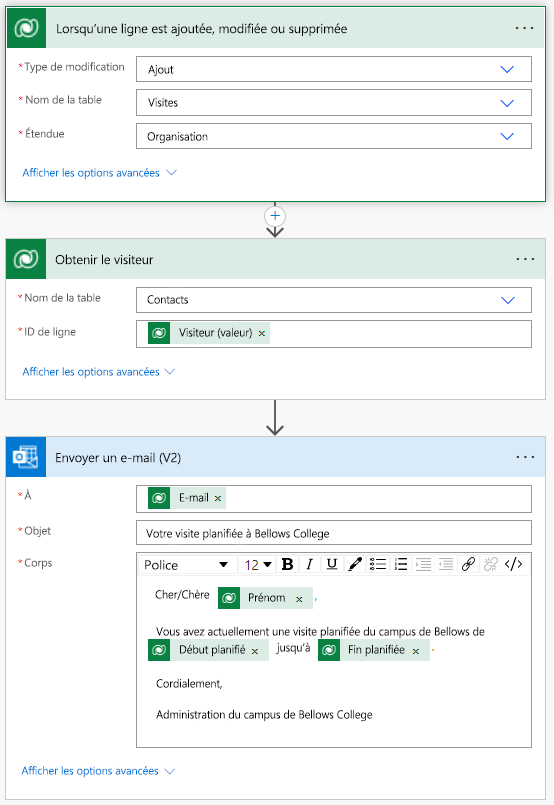

---
lab:
  title: "Labo\_4\_: Création d’une solution automatisée"
  module: 'Module 4: Get Started with Power Automate'
---

# Labo 4 : Création d’une solution automatisée

**Locataires WWL - Conditions d’utilisation** Si un locataire est fourni dans le cadre d’une formation dispensée par un instructeur, notez qu’il est mis à votre disposition dans le seul but de prendre en charge les labos pratiques de la formation. Vous ne devez ni partager ni utiliser les locataires en dehors des labos pratiques. Le locataire utilisé dans ce cours est un locataire d’essai. Au terme de la classe, le locataire ne pourra pas faire l’objet d’une prolongation et vous ne pourrez plus l’utiliser ni y accéder. Vous n’êtes pas autorisé à convertir un locataire en abonnement payant. Les locataires obtenus dans le cadre de ce cours sont la propriété de Microsoft Corporation. Nous nous réservons le droit d’y accéder et d’en reprendre possession à tout moment. 

## Scénario

Bellows College est une organisation éducative disposant de plusieurs bâtiments sur le campus. Les visiteurs du campus sont actuellement enregistrés dans des journaux papier. Les informations ne sont pas saisies de manière cohérente et il n’y a aucun moyen de collecter ni d’analyser les données concernant les visites sur l’ensemble du campus.

L’administration du campus souhaite moderniser son système d’inscription des visiteurs où l’accès aux bâtiments est contrôlé par le personnel de sécurité et toutes les visites doivent être pré-enregistrées et enregistrées par leurs hôtes.

Tout au long de ce cours, vous créerez des applications et effectuerez une automatisation pour permettre au personnel administratif et de sécurité du Bellows College de gérer et de contrôler l’accès aux bâtiments du campus.

Dans ce labo, vous allez créer un flux Power Automate pour prévenir par un e-mail un visiteur qu’une visite est programmée.

## Étapes de labo de haut niveau

Les éléments suivants ont été identifiés comme des exigences que vous devez implémenter pour terminer le projet :

- Les contacts doivent être avertis par e-mail lorsqu’une visite est planifiée.

## Prérequis

- Participation au **Module 0 - Labo 0 : Valider l’environnement de labo**
- Participation au **Module 2 Labo 1 : modélisation des données**
- Participation au **Module 2 Labo 3 : comment générer une application pilotée par modèle**
- Contact John Doe créé avec une adresse e-mail personnelle renseignée.

## Exercice 1 : Créer un flux de notification de visite

**Objectif** : Dans cet exercice, vous allez créer un flux Power Automate qui met en place ces conditions. Le visiteur doit recevoir un e-mail contenant le code unique attribué à la visite lorsqu’une visite est créée.

### Tâche \#1 : Créer un flux

1.  Accédez à <https://make.powerapps.com>. Vous devrez peut-être vous réauthentifier. Sélectionnez **Se connecter** et suivez les instructions si nécessaire.

2.  Sélectionnez votre environnement **Exercices pratiques [mes initiales]** en haut à droite, si ce n’est déjà fait.

3.  Dans le volet de navigation de gauche, sélectionnez **Flux**.

4.  Si vous y êtes invité, sélectionnez **Démarrage**.

5.  Sélectionnez **+ Nouveau flux**, puis sélectionnez **Flux cloud automatisé**.

6.  Entrez `Visit Notification` pour **Nom du flux**.

7.  Dans **Choisir le déclencheur de votre flux**, recherchez `Dataverse`.

8.  Choisissez le déclencheur **Quand une ligne est ajoutée, modifiée ou supprimée**, puis sélectionnez **Créer**.

9.  Remplissez les conditions du déclencheur pour le flux :

    1.  Sélectionner **Ajouté** pour **Type de modification**

    2.  Sélectionnez **Visites** dans la zone **Nom de table**.

    3.  Sélectionnez **Organisation** dans la liste **Étendue**.

    4.  À l’étape du déclencheur, sélectionnez les points de suspension ( **...** ), puis **Renommer**. Renommer l’étape de déclencheur `When a Visit is added` 

        Il s’agit d’une bonne pratique, qui vous permet, ainsi qu’autres éditeurs de flux, de comprendre le but de l’étape sans vous plonger dans les détails.

### Tâche \#2 : Créer une étape pour obtenir la ligne du visiteur

1.  Sélectionnez **+ Nouvelle étape**. Cette étape récupère les informations du visiteur, y compris l’adresse e-mail.

2.  Rechercher `Dataverse`

3.  Sélectionnez l’action **Obtenir une ligne par ID**.

4.  Sélectionnez **Contacts** comme **Nom de table**.

5.  Sélectionnez le champ **ID de ligne** . Notez qu’une fenêtre s’ouvre pour vous permettre de sélectionner **Contenu dynamique** ou **Expressions**.

6.  Dans le champ **ID de ligne**, sélectionnez **Visitor (valeur)** dans la liste **Contenu dynamique**. Dans cette étape, vous recherchez le contact pour la ligne Visite créée afin de déclencher ce flux. Comme l’adresse e-mail fait partie de la table Contact, vous aurez besoin de ces informations pour envoyer l’e-mail au visiteur.

7.  Dans l’action **Obtenir une ligne par ID**, sélectionnez les points de suspension ( **...** ), puis **Renommer**. Renommer cette action `Get the Visitor`
 
    Il s’agit d’une bonne pratique, qui vous permet, ainsi qu’autres éditeurs de flux, de comprendre le but de l’étape sans vous plonger dans les détails.

### Tâche \#3 : Créer une étape pour envoyer un e-mail au visiteur

1.  Sélectionnez **+ Nouvelle étape**. Il s’agit de l’étape qui permettra d’envoyer un e-mail au visiteur.

2.  Recherchez `mail`, sélectionnez l’action **Envoyer un e-mail (V2)** dans le connecteur **Office 365 Outlook**.

3.  Si vous êtes invité à accepter les conditions d’utilisation pour cette action, sélectionnez **Accepter**.

4.  Sélectionnez **Ajouter du contenu dynamique** sous le champ **À**. 
    
5.  Sélectionnez **E-mail** dans la liste Contenu dynamique.

    > Ils sont accessibles sous l’en-tête **Recevoir le visiteur**. Cela signifie que vous sélectionnez l’e-mail associé au visiteur que vous avez recherché à l’étape précédente.

7.  Dans le champ **Objet**, entrez `Your scheduled visit to Bellows College`.

8.  Entrez le texte suivant dans le **Corps du courriel**.

    > Le contenu dynamique doit être placé là où les champs sont nommés entre crochets. Il est recommandé de commencer par copier et coller l’ensemble du texte, puis d’ajouter du contenu dynamique aux endroits appropriés.

    ~~~~~~~~~~~~~~~~~~~~~~~~~~~~~~~~~~~~~~~~~~~~~~~~~~~~~~~~~~~~~~~~~~~~~~~~~~~~~~~~
    Dear {First Name},

    You are currently scheduled to visit Bellows Campus from {Scheduled Start} until {Scheduled End}.

    Best regards,

    Campus Administration
    Bellows College
    ~~~~~~~~~~~~~~~~~~~~~~~~~~~~~~~~~~~~~~~~~~~~~~~~~~~~~~~~~~~~~~~~~~~~~~~~~~~~~~~~

8.  Mettez en surbrillance le texte **{First Name}** . Remplacez-le par le champ **Prénom** de l’étape **Obtenir le visiteur**.

9.  Mettez en surbrillance le texte **{Scheduled Start}** . Remplacez-le par le champ **Début prévu** de l’étape **Lorsqu’une visite est ajoutée**.

10.  Mettez en surbrillance le texte **{Scheduled End}** . Remplacez-le par le champ **Fin prévue** de l’étape **Lorsqu’une visite est ajoutée**.

11.  Sélectionnez **Enregistrer**.

Laissez cet onglet de flux ouvert pour la tâche suivante. Votre flux doit ressembler à ce qui suit :

### Tâche \#4 : Valider et tester le flux

1.  Ouvrez un nouvel onglet dans votre navigateur et accédez à <https://make.powerapps.com>.

2.  Sélectionnez votre environnement **Exercices pratiques [mes initiales]** en haut à droite, si ce n’est déjà fait.

3.  Sélectionnez **Applications**, puis ouvrez l’application pilotée par modèle **Bellows Campus Management** que vous avez créée précédemment.

3.  En laissant cet onglet de navigateur ouvert, revenez à l’onglet précédent avec votre flux.

4.  Dans la barre de commandes, sélectionnez **Tester**. Sélectionnez **Manuellement**, puis **Tester**.

5.  Accédez à l’onglet du navigateur en ayant votre application pilotée par modèle ouverte. 

6.  Dans la navigation du plan du site à gauche, sélectionnez **Visits** (Visites).

6.  Sélectionnez le bouton **+ Nouveau** pour ajouter un nouvel enregistrement **Visit**.

7.  Renseignez l’enregistrement Visite comme ceci :

    -   **Nom :** `Test Visit`

    -   **Visiteur :** John Doe

    -   **Début prévu :** Demain à 8 h 00

    -   **Fin prévue :** Demain à 9 h 00

8.  Sélectionnez le bouton **Enregistrer et fermer**.

9.  Accédez à l’onglet du navigateur où votre test de flux est en cours d’exécution. Après un court délai, vous devez voir le flux en cours d’exécution. C'est là que vous pouvez détecter tout problème dans le flux ou confirmer qu’il s'est bien déroulé.

    Après un court délai, vous devriez voir un e-mail dans votre boîte de réception, car vous avez indiqué l’e-mail de John Doe comme votre e-mail personnel. Notez que cet e-mail peut se retrouver dans votre dossier Courrier indésirable.

## Problème

- Essayez différentes options de mise en forme sur l’e-mail. Comment pouvez-vous le rendre plus professionnel ?

