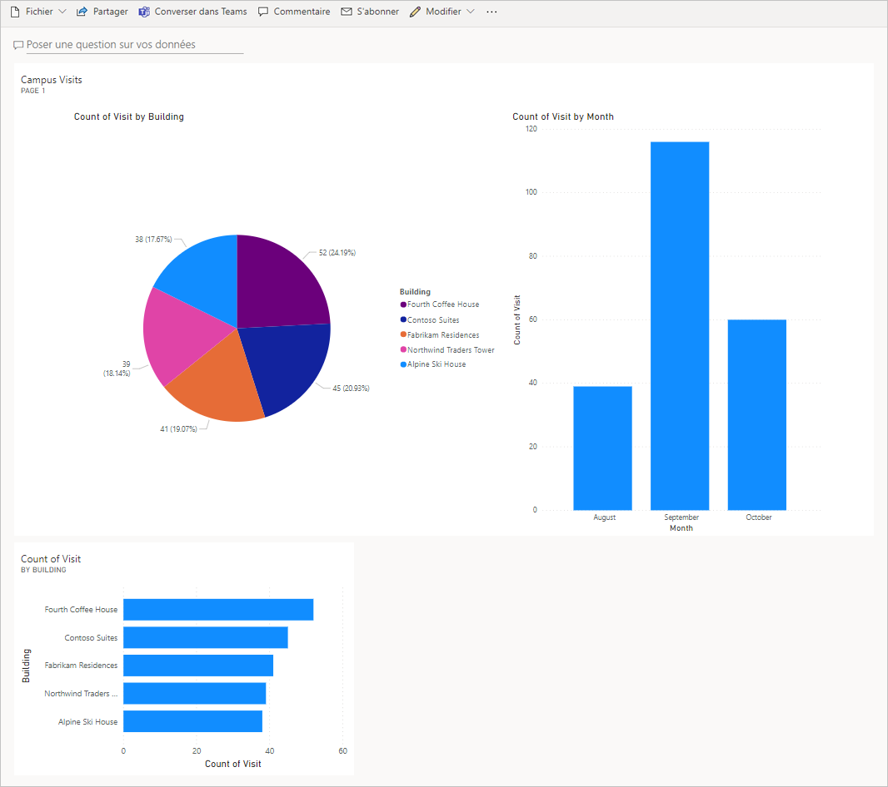

---
lab:
  title: "Labo\_5\_: Comment créer un tableau de bord simple"
  module: 'Module 5: Get Started with Power BI'
---

## Labo 5 : Comment créer un tableau de bord simple

**Locataires WWL - Conditions d’utilisation** Si un locataire est fourni dans le cadre d’une formation dispensée par un instructeur, notez qu’il est mis à votre disposition dans le seul but de prendre en charge les labos pratiques de la formation. Vous ne devez ni partager ni utiliser les locataires en dehors des labos pratiques. Le locataire utilisé dans ce cours est un locataire d’essai. Au terme de la classe, le locataire ne pourra pas faire l’objet d’une prolongation et vous ne pourrez plus l’utiliser ni y accéder. Vous n’êtes pas autorisé à convertir un locataire en abonnement payant. Les locataires obtenus dans le cadre de ce cours sont la propriété de Microsoft Corporation. Nous nous réservons le droit d’y accéder et d’en reprendre possession à tout moment. 

## Scénario

Bellows College est une organisation éducative disposant de plusieurs bâtiments sur le campus. Les visiteurs du campus sont actuellement enregistrés dans des journaux papier. Les informations ne sont pas saisies de manière cohérente et il n’y a aucun moyen de collecter ni d’analyser les données concernant les visites sur l’ensemble du campus.

L’administration du campus souhaite moderniser son système d’inscription des visiteurs où l’accès aux bâtiments est contrôlé par le personnel de sécurité et toutes les visites doivent être pré-enregistrées et enregistrées par leurs hôtes.

Tout au long de ce cours, vous créerez des applications et effectuerez une automatisation pour permettre au personnel administratif et de sécurité du Bellows College de gérer et de contrôler l’accès aux bâtiments du campus.

Dans ce labo, vous allez créer un rapport et un tableau de bord Power BI qui permet de visualiser les données des visites sur le campus.

## Étapes de labo de haut niveau

Nous allons suivre les étapes ci-dessous pour concevoir et créer un tableau de bord Power BI :

-   Créer un rapport avec diverses visualisations des informations concernant les visites sur le campus

-   Utiliser une requête en langage naturel pour créer des visualisations supplémentaires

## Prérequis

- Participation au **Module 0 - Labo 0 : Valider l’environnement de labo**
- Participation au **Module 2 Labo 1 : modélisation des données**

## Éléments à considérer avant de commencer

-   À quel public ce rapport est-il destiné ?
-   Comment les participants utiliseront-ils le rapport ? Appareil courant ? L’emplacement ?
-   Avez-vous suffisamment de données à visualiser ?
-   Quelles sont les caractéristiques utilisables pour analyser les données sur les visites ?

## Exercice 1 : Créer des rapports Power BI

**Objectif** : Dans cet exercice, vous allez créer un rapport Power BI basé sur les données de la feuille de calcul Excel que nous avons utilisée dans un exercice précédent.

### Tâche \#1 : Préparer le service Power BI

1.  Vous devez avoir un fichier visits.pbix stocké sur votre machine virtuelle, dans le dossier AllFiles sur le Bureau. Téléchargez [visits.pbix](https://github.com/MicrosoftLearning/PL-900-Microsoft-Power-Platform-Fundamentals/raw/master/Allfiles/visits.pbix) et enregistrez-le sur votre ordinateur, s’il n’y est pas déjà.

2.  Ouvrez un nouvel onglet, accédez à `https://app.powerbi.com` et connectez-vous si besoin.

3.  Sélectionnez **Mon espace de travail** dans le volet de navigation de gauche.

5.  Sélectionnez **Charger**, puis **Parcourir**.

6.  Localisez et sélectionnez le fichier **visits.pbix** que vous avez téléchargé précédemment. 

7.  Une fois le chargement des données terminé, sélectionnez le rapport **visits**.

    > **Remarque :** Le Type est défini sur **Rapport**, ne sélectionnez pas le jeu de données.

8.  Sélectionnez **Modifier**. 

    Si l’élément de menu **Modifier** n’est pas visible, sélectionnez les points de suspension **…** , puis **Modifier**.

Vous avez terminé la configuration du service Power BI que vous utiliserez pour vos labos.

### Tâche \#2 : Créer un graphique et des visualisations temporelles

1.  Sélectionnez l’icône **Graphique en secteurs** dans le panneau **Visualisations** pour insérer un graphique.

2.  Développez **bc_Visit** dans le panneau **Champs**. Faites glisser le champ **Building** (Bâtiment) et déposez-le dans la zone **Légende**.

3.  Faites glisser le champ **Visit** et déposez-le dans la zone **Valeurs**.

4.  Redimensionnez le graphique en secteurs à l’aide des poignées d’angle afin que tous les composants du graphique soient visibles.

5.  Cliquez sur le rapport en dehors du graphique en secteurs pour le désélectionner, puis sélectionnez l’icône de graphique **Histogramme empilé** dans le panneau **Visualisations**.

6.  Développez **bc_Visit** dans le volet **Champs** s’il n’est pas déjà développé. Faites glisser le champ **Visit** et déposez-le dans la zone **Axe Y**.

7.  Faites glisser le champ **Start** (Début) et déposez-le dans la zone **Axe X**.

8.  Dans le panneau **Visualisations**, sélectionnez le **x** en regard des champs **Année** et **Trimestre** pour ne laisser que les totaux **Mois** et **Jour** pour l’axe X.

9.  Redimensionnez le graphique selon les besoins, à l’aide des poignées d’angle.

10. Testez l’interactivité du rapport :

    1.  Sélectionnez différents secteurs sur le graphique en secteurs et observez les changements sur le graphique en histogramme empilé.

    2.  Sélectionnez le graphique en histogramme empilé. Sélectionnez la flèche vers le haut pour **Monter dans la hiérarchie**. Sélectionnez la flèche vers le bas pour activer le mode **Descendre dans la hiérarchie**, puis sélectionnez une colonne pour descendre au niveau suivant (les jours).

    3.  Explorez en remontant ou en descendant d’un niveau, et sélectionnez différentes barres sur l’histogramme empilé pour observer les changements sur le graphique en secteurs.

11. Enregistrez le travail en cours en sélectionnant **Enregistrer ce rapport**.

## Exercice 2 : Créer un tableau de bord Power BI

### Tâche \#1 : Créer un tableau de bord Power BI

1.  Vous pouvez accéder au rapport ouvert depuis la tâche précédente.

2.  Sélectionnez **Épingler à un tableau de bord** dans le menu. Selon la disposition, il peut être nécessaire de sélectionner le menu de points de suspension  **…** pour afficher plus d’options.

3.  Sélectionnez **Nouveau tableau de bord** sur l’invite **Épingler au tableau de bord**.

4.  Entrez `Campus Management` pour **Nom du tableau de bord** et sélectionnez **Épingler un élément dynamique**.

5.  Une fenêtre contextuelle vous indique que le tableau de bord a été créé. Sélectionnez **Accéder au tableau de bord**.

6.  Testez l’interactivité des graphiques en secteurs et à barres affichés.

### Tâche \#2 : Ajouter des visualisations à l’aide du langage naturel

1.  Au sein de votre tableau de bord **Gestion du campus**, sélectionnez la barre **Poser une question sur vos données**.

2.  Entrez `buildings by number of visits` dans la zone Questions et réponses. Un graphique à barres s’affiche.

3.  Sélectionnez **Épingler un élément visuel**.

4.  Sélectionnez **Tableau de bord existant**, sélectionnez votre tableau de bord **Campus Management** (Gestion du campus), puis appuyez sur **Épingler**.

5.  Sélectionnez **Quitter Questions et réponses**.

Votre tableau de bord **Gestion du campus** doit s’afficher avec trois visuels. Vous devrez peut-être faire défiler vers le bas pour voir le nouveau visuel de questions et réponses.

Votre tableau de bord doit ressembler à ce qui suit :

