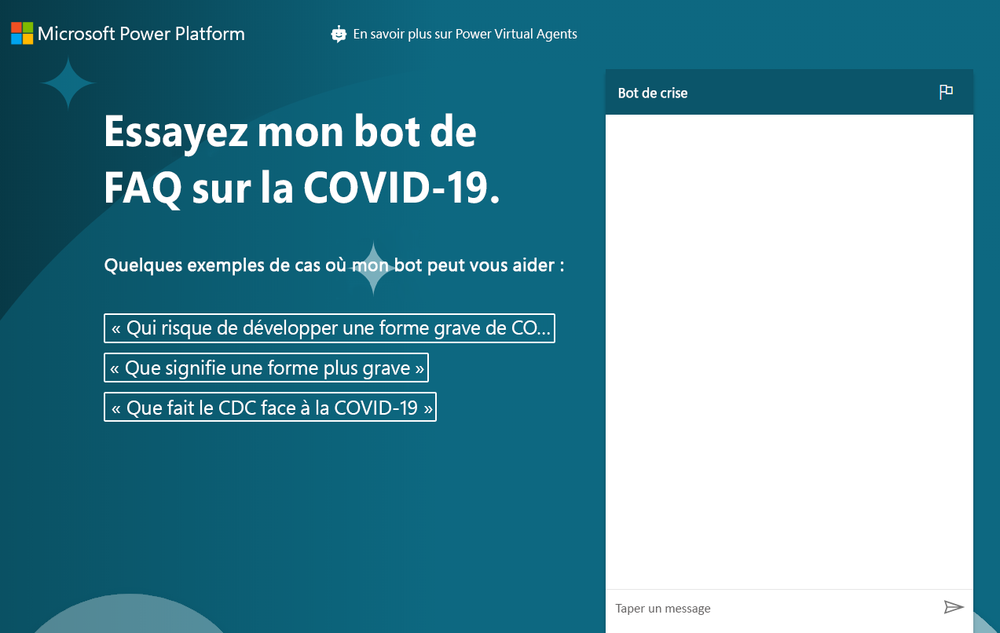

---
lab:
  title: 'Labo 8 : Comment créer un chatbot de base'
  module: 'Module 6: Intro to Power Virtual Agents'
ms.openlocfilehash: ed1611f4b1450093a6e95cbb9df7ad7fdc040e86
ms.sourcegitcommit: ef58c858463b890e923ef808b1d43405423943fd
ms.translationtype: HT
ms.contentlocale: fr-FR
ms.lasthandoff: 01/27/2022
ms.locfileid: "137898939"
---
# <a name="module-6-intro-to-power-virtual-agents"></a>Module 6 : Introduction à Power Virtual Agents
## <a name="lab-how-to-build-a-basic-chatbot"></a>Labo : Comment créer un chatbot de base

# <a name="scenario"></a>Scénario

Bellows College est une organisation éducative disposant de plusieurs bâtiments sur le campus. Les visites sur le campus sont actuellement enregistrées dans des journaux papier. Les informations ne sont pas saisies de manière cohérente et il n’y a aucun moyen de collecter ni d’analyser les données concernant les visites sur l’ensemble du campus.

Comme la plupart des organisations, Bellows College répond rapidement aux préoccupations concernant la désinformation au sujet de la COVID-19, les pratiques exemplaires, les horaires, etc. Dans ce labo, vous apprendrez à créer un chatbot Power Virtual Agent qui pointera vers la page du Center for Disease Control avec des questions et réponses concernant l’état actuel de la pandémie. Le collège voudra que cette configuration puisse être intégrée à son site portail et rendue disponible de façon ponctuelle au fur et à mesure que les départements effectuent leur propre réouverture prévue.

## <a name="high-level-steps"></a>Étapes de haut niveau

Nous suivrons le schéma ci-dessous pour créer notre Power Virtual Agent :

  - Inscrivez-vous pour une version d’essai de Power Virtual Agent

  - Créez un bot en utilisant les FAQ

  - Tester le bot

  - Modifiez le message d’accueil par défaut

  - Publier le bot

  - **Question bonus :** Incorporez le bot dans votre portail

## <a name="prerequisites"></a>Prérequis

Les éléments suivants ont été identifiés comme des exigences que vous devez implémenter pour terminer le projet :

  - Participation au **Module 0 - Labo 0 : Valider l’environnement de labo**

  - Participation au **Module 2 - Labo 1 : Présentation de Microsoft Dataverse**

  - Exercice bonus seulement : Achèvement du **Module 6 Labo 4 - Introduction aux portails Power Apps** 

## <a name="things-to-consider-before-you-begin"></a>Éléments à considérer avant de commencer

Les bots peuvent être très utiles dans de nombreux scénarios. Sur la base de ce que vous avez appris sur Bellows College, déterminez à quel autre endroit de l’organisation un bot pourrait être utile.

# <a name="exercise-1-sign-up-for-pva-and-create-a-new-bot"></a>Exercice \#1 : Inscrivez-vous à PVA et créez un nouveau bot

Dans cet exercice, vous vous inscrirez à la version d’essai de Power Virtual Agents.

1.  Accéder à [Power Virtual Agents](https://powerva.microsoft.com/)

2.  Cliquez sur **Commencer l’essai gratuit**.

3.  Connectez-vous, si nécessaire.

4. La fenêtre **Créer un nouveau bot** s’affiche.

5. Entrez **Bot de crise** comme **Nom** et sélectionnez une langue.

6. Sélectionnez votre environnement de pratique pour créer le bot et cliquez sur **Créer**. Attendez que le bot soit créé. Cliquez sur **Explorer le robot** si vous y êtes invité.

7. Testez le bot. Tapez **« Bonjour »** dans la boîte de message et cliquez sur **Envoyer**. Le bot va ensuite vous saluer et vous dire ce qu’il peut faire.

8. Fermez la fenêtre de **conversation**.

9. Sélectionnez **Rubriques**. Le bot présente des échantillons de sujets utilisateur et des sujets système. Le message d’accueil par défaut provenait des rubriques système.

> Dans l’exercice suivant, vous générerez vos propres sujets à partir du site de FAQ du CDC. Ne quittez pas cette fenêtre de navigateur.

# <a name="exercise-2-create-topics"></a>Exercice \#2 : Créer des sujets

Au cours de cet exercice, vous allez générer des sujets à partir du site FAQ du CDC.

1.  Dans un nouvel onglet, accédez au site [FAQ du CDC](https://www.cdc.gov/coronavirus/2019-ncov/faq.html) et examinez les éléments présents sur le site. Vous générerez vos sujets à partir de ces FAQ.

2.  Copiez l’URL.

3.  Revenez à Power Virtual Agents et assurez-vous que l’option **Sujets** est toujours sélectionnée.

4.  Sélectionnez l’onglet **Suggestions**, disponible sous l’option **Sujets**.

5.  Cliquez sur **Démarrer.**

6. Collez l’URL que vous avez copiée dans la zone de texte **Lien vers le contenu en ligne** et cliquez sur **Ajouter**. Notez que si vous avez copié l’URL complète, https:// est listé deux fois. Assurez-vous que l’URL ne répertorie le protocole qu’une seule fois.

7.  Cliquez sur **Démarrer** et attendez. Cette opération peut prendre quelques minutes.

8.  Vous accédez ensuite à des suggestions de sujets créés pour vous. Cliquez pour ouvrir l’un des sujets suggérés.

9. La phrase de déclenchement et la réponse du bot s’affichent. **Cliquez sur Ajouter aux sujets.**
    
10. Le sujet suggéré s’ajoute à vos sujets. Sélectionnez tous les sujets suggérés et cliquez sur **Ajouter aux sujets** 

    > Vous pouvez sélectionner tous les sujets en utilisant l’icône affichée sur la gauche de la colonne Nom. Si vous recevez un message d’erreur, veuillez réessayer.

11. Une fois les sujets suggérés ajoutés, sélectionnez l’onglet **Existant**. Le statut des nouveaux sujets passe ensuite à Désactivé.

12. Utilisez le bouton bascule de la colonne **Statut** pour définir certains sujets sur **Activé**. 

13. Notez la phrase de déclenchement de l’un des sujets que vous avez activés afin de pouvoir le tester plus tard.

> Ne quittez pas cette fenêtre de navigateur.

# <a name="exercise-3-test-topics"></a>Exercice \#3 : Tester les sujets

Dans cette tâche, nous allons tester les sujets que vous avez ajoutés.

1.  Cliquez sur **Tester votre robot** en bas à gauche.

2.  Cliquez sur **Réinitialiser**.

3.  Saisissez la phrase de déclenchement que vous avez enregistrée à partir de la tâche précédente et cliquez sur **Envoyer**.

4.  Le bot doit vous donner les informations correctes et vous demander s’il a répondu à votre question. Cliquez sur **Oui**.

5.  Le bot vous demandera ensuite une note sur sa façon de faire. Donnez-lui une excellente note.

6.  Le bot vous demande ensuite s’il peut vous aider pour autre chose. Cliquez sur **Non merci**.

7.  Le bot termine ensuite la session de conversation.

8.  Tapez **Bonjour** et cliquez sur **Envoyer**.

9.  Le bot va ensuite vous saluer et vous dire ce qu’il peut faire. Votre bot peut désormais aider les utilisateurs avec les FAQ pour le COVID-19. Vous devrez donc modifier le message d’accueil dans la tâche suivante. Ne quittez pas cette fenêtre de navigateur.

# <a name="exercise-4-change-the-greeting"></a>Exercice \#4 : Changer le message d’accueil

Dans cette tâche, vous allez modifier le message d’accueil spécifique à la crise COVID-19.

1.  Assurez-vous que **Sujets** est sélectionné et activez l’onglet **Existant**.

2.  Réduisez la section **Sujets utilisateur**.

3.  Cliquez pour ouvrir le sujet **Message d’accueil** des sujets système. Vous pouvez également utiliser la zone de recherche pour **Rechercher des sujets existants**.

4.  Le sujet de message d’accueil contient 52 phrases de déclenchement. Cliquez sur **Accéder au canevas de création**.

5.  Accédez au premier message et remplacez-le par `Hi, I’m a virtual agent. I can tell you about how COVID-19 spreads, how to protect yourself, preparing your home and family for COVID-19, symptoms, testing, and more.`

6.  Cliquez sur **Enregistrer**.

7.  Cliquez sur **Tester le bot** si votre bot n’est pas encore ouvert. Cliquez sur **Réinitialiser** pour réinitialiser la conversation.

8.  Tapez « Bonjour » et cliquez sur **Envoyer**.

9.  Le bot devrait maintenant répondre avec le nouveau message d’accueil.

# <a name="exercise-5-publish-the-bot"></a>Exercice \#5 : Publier le bot

Dans cet exercice, vous allez apprendre à publier le bot.

1.  Sélectionnez **Publier** dans la barre de navigation de gauche.

2.  Cliquez sur **Publier**.

3.  Cliquez sur **Publier** à nouveau et attendez la fin de la publication.

4.  Développez le menu **Gérer** dans la barre de navigation de gauche et sélectionnez **Chaînes**.

5.  Vous accédez à la liste des canaux disponibles sur lesquels vous pouvez publier votre bot. Sélectionnez **Version de démonstration du site web**.

6.  Remplacez le message d’accueil par `Try my COVID-19 FAQ bot.`

7.  Entrez ce qui suit dans la zone **Démarreurs de conversation** :
    ```
     “Who is at higher risk for serious illness from COVID-19”
     “What does more severe illness mean”
     “What is the CDC doing about COVID-19”
    ```
    
8.  Cliquez sur **Enregistrer**.

9.  Copiez l’**URL**.

> Vous pouvez partager l’URL avec vos collègues et obtenir leurs commentaires. 

10.  Ouvrez une nouvelle fenêtre ou un nouvel onglet de navigateur et accédez à l’URL que vous avez copiée. Le site web de démonstration doit ressembler à l’image ci-dessous.

11. Commencez à discuter avec le bot.  
    
Une fois terminé, votre bot publié doit ressembler à ceci :



# <a name="challenges"></a>Défis 
* Intégrez votre chatbot sur votre portail des visiteurs du Bellows College (vous trouverez plus d’informations sur la façon de procéder sous la rubrique **Ajouter un robot à Power Apps** [ici](https://docs.microsoft.com/en-us/power-virtual-agents/publication-connect-bot-to-web-channels).)
